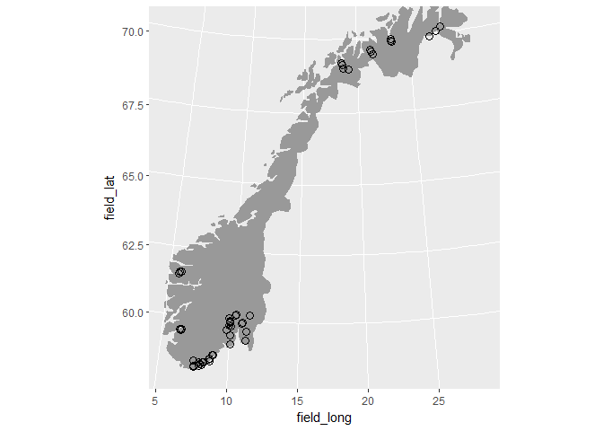
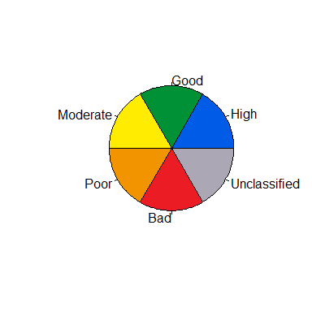
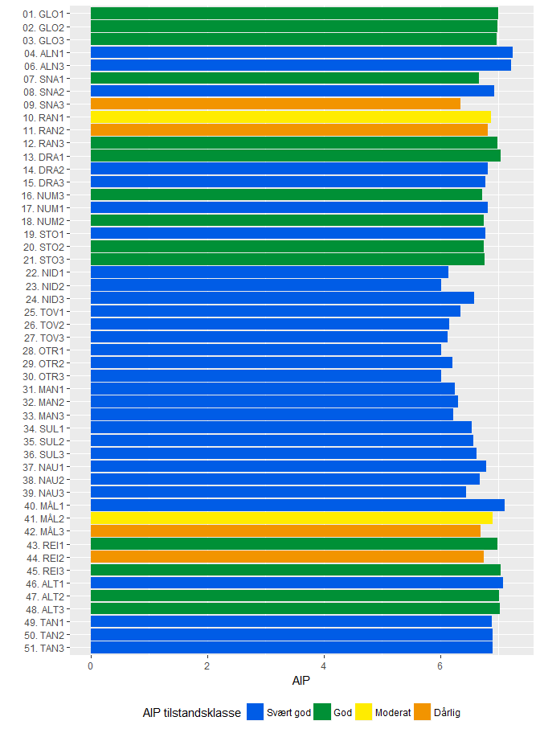
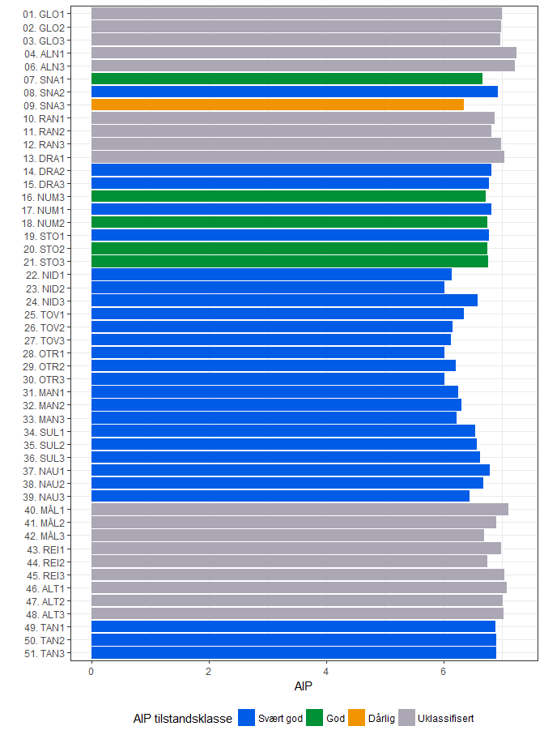
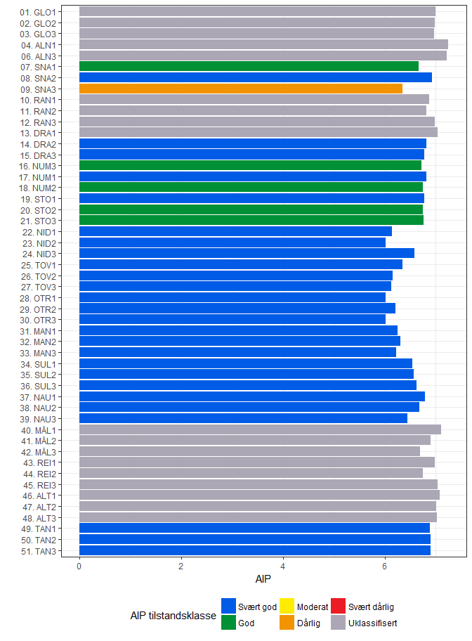
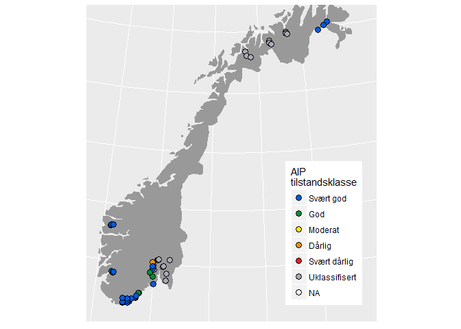
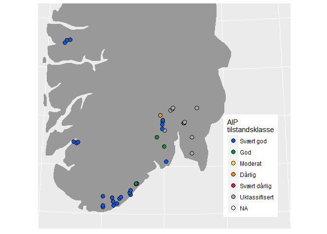

Based on code from "C:\Data\Referanseelver_2018\04_Paavekstalger\01_Plots.Rmd"

# Libraries

```r
library(tidyverse)
```

```
## -- Attaching packages ---------------------------------------- tidyverse 1.2.1 --
```

```
## v ggplot2 2.2.1     v purrr   0.2.4
## v tibble  1.4.2     v dplyr   0.7.5
## v tidyr   0.8.1     v stringr 1.3.1
## v readr   1.1.1     v forcats 0.3.0
```

```
## -- Conflicts ------------------------------------------- tidyverse_conflicts() --
## x dplyr::filter() masks stats::filter()
## x dplyr::lag()    masks stats::lag()
```

```r
library(readxl)
library(sp)           # SpatialPoints(), CRS(), spTransform()

df_classification <- tibble(
  Tilstandsklasse = c("S","G","M","D","SD"),
  Tilstandsklasse2 = c("Svært god","God","Moderat","Dårlig","Svært dårlig")
  )

df_kalk <- read_excel("Data/Kalkrike_lokaliteter.xlsx")

levels_tilstand <- c("Svært god","God","Moderat","Dårlig","Svært dårlig","Uklassifisert")

# Map
map_norway <- map_data("world", "Norway")
```

```
## 
## Attaching package: 'maps'
```

```
## The following object is masked from 'package:purrr':
## 
##     map
```

#### Theme for map

```r
theme_noaxes <- theme(axis.line=element_blank(),
      axis.text.x=element_blank(),
      axis.text.y=element_blank(),
      axis.ticks=element_blank(),
      axis.title.x=element_blank(),
      axis.title.y=element_blank())
```

# Read data
## Station data

```r
# dir("Data")
fn <- "Data/Rapportmal_samlet_klassifisering_Elveovervåking2017 (002)_FISK.xlsx"
df_aip <- read_excel(fn, sheet = "Begroing AIP") %>%
  rename(Tilstandsklasse_kort = Tilstandsklasse, Tilstandsklasse = Tilstandsklasse__1) %>%
  mutate(Tilstandsklasse_f = factor(Tilstandsklasse, levels = levels_tilstand)) %>%
  mutate(Indeksverdi = as.numeric(Indeksverdi),
         EQR = as.numeric(EQR),
         nEQR = as.numeric(nEQR)) %>%
  left_join(df_kalk)
```

```
## Joining, by = "Rapportnavn"
```

```r
df_aip$Rapportnavn <- factor(df_aip$Rapportnavn, levels = rev(df_aip$Rapportnavn))
```

## Coordinates
### Read file

```r
fn <- "Data/Opsjon3 i 2017_koordinater til Maia_AM_aug17_sept28.xlsx"
df_coor <- read_excel(fn, range = "N2:AF87") %>%
  rename(field_UTM_x = `UTM Ø__1`, field_UTM_y = `UTM N__1`, field_zone = Sone__1) %>%
  filter(!is.na(field_UTM_x) | grepl("Øverbygd", Stasjonsnavn_data))
# df_coor$Stasjonsnavn_data 
```


### Transform coordinates to long, lat

```r
# table(df_coor$field_zone)
crs_longlat <- "+proj=longlat"
crs_utm_32 <- "+proj=utm +zone=32 +ellps=WGS84 +datum=WGS84 +units=m"
crs_utm_34 <- "+proj=utm +zone=34 +ellps=WGS84 +datum=WGS84 +units=m"
crs_utm_35 <- "+proj=utm +zone=35 +ellps=WGS84 +datum=WGS84 +units=m"
transform_utm <- function(df, var_utm_x = "field_UTM_x", var_utm_y = "field_UTM_y", crs_utm){
  SP.utm <- SpatialPoints(df[,c(var_utm_x, var_utm_y)], 
                        proj4string=CRS(crs_utm)
                        )
  SP.longlat <- spTransform(SP.utm, CRS(crs_longlat))
  SP.longlat@coords
  }

# Test
# sel <- df_coor$field_zone == 35
# transform_utm(df_coor[sel,], crs_utm = crs_utm_35)

# For all lines with UTM data (i.e., not Målselva v/ Øverbygd)
# Go through each of the 3 UTM zones used
trans_list <- list(
  list(32, crs_utm_32),
  list(34, crs_utm_34),
  list(35, crs_utm_35))
df_coor$field_long <- NA
df_coor$field_lat <- NA
for (i in 1:3){
  sel <- df_coor$field_zone %in% trans_list[[i]][[1]]
  M <- transform_utm(df_coor[sel,], crs_utm = trans_list[[i]][[2]])
  df_coor[sel, c("field_long","field_lat")] <- M
}

# For Målselva v/ Øverbygd, we pick the nominal coordinates
sel <- grepl("Øverbygd", df_coor$Stasjonsnavn_data)
# sum(sel)
df_coor[sel, c("field_long","field_lat")] <- df_coor[sel, c("Lengdegrad Ø","Breddegrad N")]
```

### Test map

```r
gg <- ggplot(df_coor, aes(field_long, field_lat)) + 
  annotation_map(map_norway, fill = "grey60") +
  geom_point(pch = 21, size = 3) +
  coord_map("lambert", parameters = c(64, 12)) 
  # coord_map("lambert", parameters = c(64, 12), ylim = c(57.7, 62.3), xlim = c(5,15)) + 
gg
```

<!-- -->

### Check if each coordinate has a corresponding record in the data file
No data for the new Målselv RID position:

```r
df <- left_join(df_coor, df_aip %>% select(Stasjonsnavn,Rapportnavn), 
                     by = c("Stasjonsnavn_data"="Stasjonsnavn"))
# df_coor %>% select(Stasjonsnavn,Rapportnavn) %>% View()
df %>% filter(is.na(Rapportnavn)) %>% select(Stasjonsnavn,Rapportnavn)
```

<div data-pagedtable="false">
  <script data-pagedtable-source type="application/json">
{"columns":[{"label":["Stasjonsnavn"],"name":[1],"type":["chr"],"align":["left"]},{"label":["Rapportnavn"],"name":[2],"type":["fctr"],"align":["left"]}],"data":[{"1":"Målselv- evt ny RID stasjon","2":"NA"}],"options":{"columns":{"min":{},"max":[10]},"rows":{"min":[10],"max":[10]},"pages":{}}}
  </script>
</div>

## Add longitude, latitude to the data file
All data have coordinates.

```r
df_aip <- left_join(df_aip, df_coor %>% select(Stasjonsnavn_data,field_long,field_lat), 
                     by = c("Stasjonsnavn"="Stasjonsnavn_data"))
# df_coor %>% select(Stasjonsnavn,Rapportnavn) %>% View()
cat(
  "Count of data without coordinates:\n", 
  sum(is.na(df_aip$field_long))
  )
```

```
## Count of data without coordinates:
##  0
```

```r
# grep("verbygd", df_aip$Stasjonsnavn, value = TRUE)
# grep("verbygd", df_coor$Stasjonsnavn_data, value = TRUE)
```
## Test colours

```r
# Colors
df_colors <- read_excel("Data/Fargekoder RGB for tilstandsklassifisering.xlsx", sheet = 2)
class_colors <- with(df_colors, rgb(R/255, G/255, B/255))
pie(rep(1,length(class_colors)), df_colors$Status, col = class_colors)
```

<!-- -->

# Bar plots indeksverdi {.tabset}
## All bars coloured

```r
gg <- ggplot(df_aip %>% filter(!is.na(Indeksverdi)), aes(Rapportnavn, Indeksverdi, fill = Tilstandsklasse_f)) + 
  geom_bar(stat = "identity") +
  scale_fill_manual("AIP tilstandsklasse", values = class_colors) +
  coord_flip() + 
  theme(legend.position = "bottom") +
  labs(x = "", y = "AIP")
gg
```

<!-- -->

## Calcareous rivers greyed out (legend type 1)
Legend contains only the categories that are in the data

```r
df_aip_kalk <- df_aip %>%
  mutate(Tilstandsklasse = ifelse(Kalkrik %in% "Moderat kalkrik", "Uklassifisert", Tilstandsklasse)) %>%
  mutate(Tilstandsklasse_f = factor(Tilstandsklasse, levels = levels_tilstand))   # %>% View()

# How to get the right colors - version 1 (returns only the observed colors in the legend)
levels_obs <- xtabs(~as.numeric(Tilstandsklasse_f), df_aip_kalk, drop = TRUE) %>% names() %>% as.numeric()

gg <- ggplot(df_aip_kalk %>% filter(!is.na(Indeksverdi)), 
             aes(Rapportnavn, Indeksverdi, fill = Tilstandsklasse_f)) + 
  geom_bar(stat = "identity") +
  scale_fill_manual("AIP tilstandsklasse", values = class_colors[levels_obs]) +
  coord_flip()  +
  labs(x = "", y = "AIP") +
  theme_bw() + 
  theme(legend.position = "bottom")
gg
```

<!-- -->

## Calcareous rivers greyed out (legend type 2)
Legend contains all categories

```r
# How to get the right colors - version 2 (returns all colors in the legend)
gg <- ggplot(df_aip_kalk %>% filter(!is.na(Indeksverdi)), 
             aes(Rapportnavn, Indeksverdi, fill = Tilstandsklasse_f)) + 
  geom_bar(stat = "identity") +
  scale_fill_manual("AIP tilstandsklasse", values = class_colors, drop = FALSE) +
  coord_flip() + 
  labs(x = "", y = "AIP") +
  theme_bw() +
  theme(legend.position = "bottom")
gg
```

<!-- -->

# Barplot nEQR

```r
# How to get the right colors - version 2 (returns all colors in the legend)
gg <- ggplot(df_aip_kalk %>% filter(!is.na(Indeksverdi)), 
             aes(Rapportnavn, Indeksverdi, fill = Tilstandsklasse_f)) + 
  geom_bar(stat = "identity") +
  scale_fill_manual("AIP tilstandsklasse", values = class_colors, drop = FALSE) +
  coord_flip() + 
  labs(x = "", y = "nEQR") +
  theme_bw() +
  theme(legend.position = "bottom")
gg
```

<!-- -->

# Maps of AIP {.tabset}
## All of Norway

```r
gg <- ggplot(df_aip_kalk, aes(field_long, field_lat, fill = Tilstandsklasse_f)) + 
  annotation_map(map_norway, fill = "grey60") +
  geom_point(pch = 21, size = 3) +
  scale_fill_manual("AIP\ntilstandsklasse", values = class_colors, drop = FALSE) +
  coord_map("lambert", parameters = c(64, 12)) + 
  theme_noaxes +
  theme(legend.position = c(.95, .05),
        legend.justification = c("right", "bottom"),
        legend.box.just = "right",
        legend.margin = margin(6, 6, 6, 6))
#if (save_plots)
#  ggsave("Figures/01_01_AIP_kart.png", gg, width = 7, height = 7, dpi = 500)
gg
```

<!-- -->

## South Norway

```r
gg <- ggplot(df_aip_kalk, aes(field_long, field_lat, fill = Tilstandsklasse_f)) + 
  annotation_map(map_norway, fill = "grey60") +
  geom_point(pch = 21, size = 3) +
  scale_fill_manual("AIP\ntilstandsklasse", values = class_colors, drop = FALSE) +
  coord_map("lambert", parameters = c(64, 12), ylim = c(57.7, 62.3), xlim = c(5,15)) + 
  theme_noaxes +
  theme(legend.position = c(.95, .05),
        legend.justification = c("right", "bottom"),
        legend.box.just = "right",
        legend.margin = margin(6, 6, 6, 6))
#if (save_plots)
#  ggsave("Figures/01_01_AIP_kart.png", gg, width = 7, height = 7, dpi = 500)
gg
```

<!-- -->


