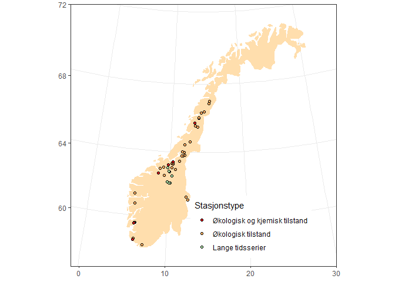
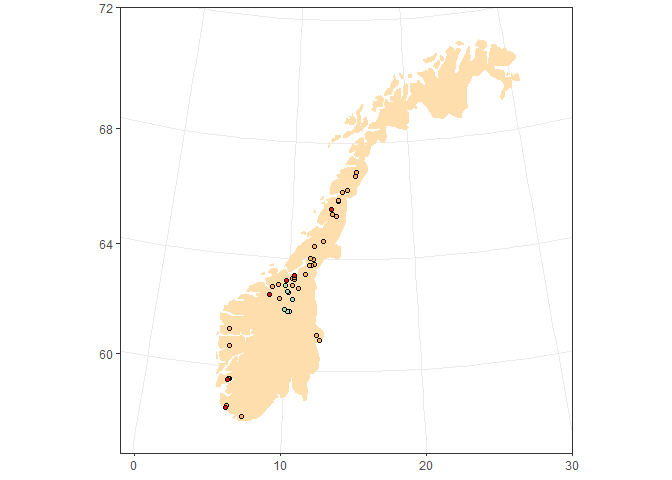
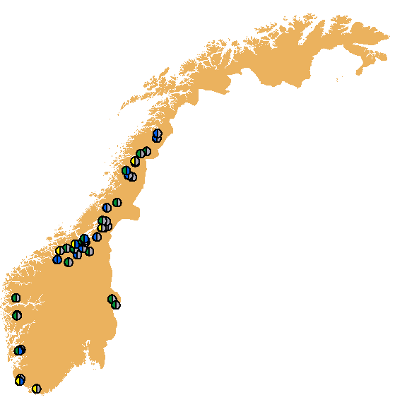
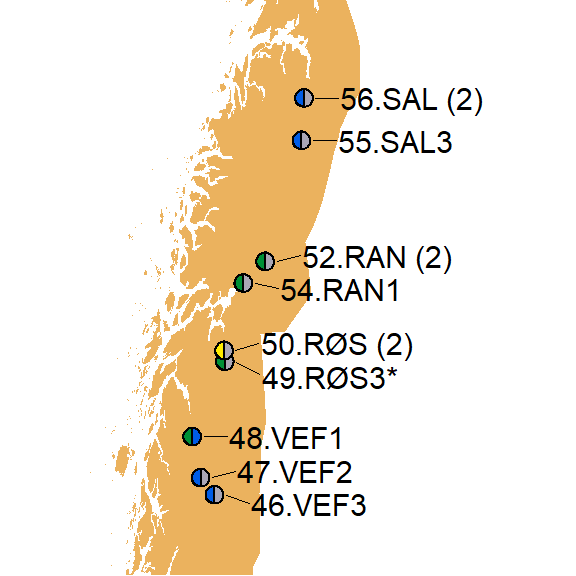
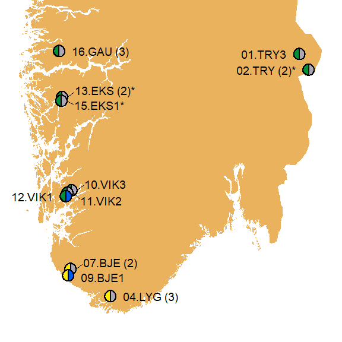
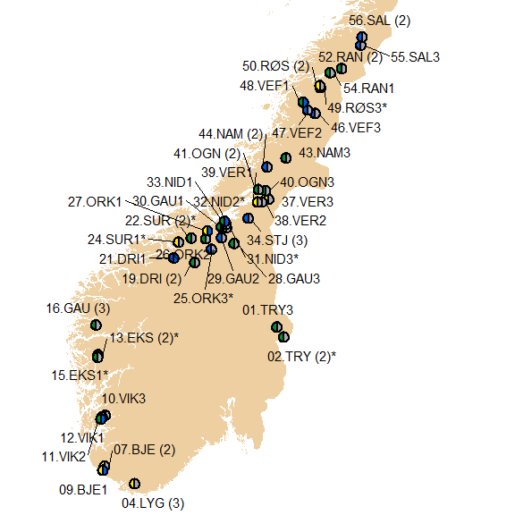
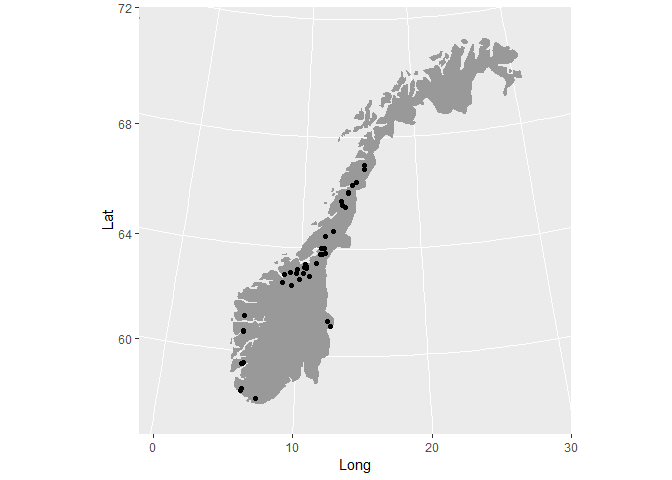
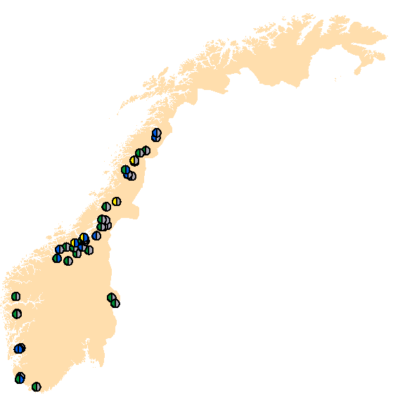
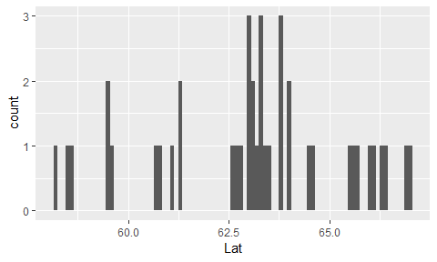

Put pies on maps    

## 0. Prerequisites
### a. Libs + map

```r
library(tidyverse)  # filter, group_by, summary, etc.
```

```
## -- Attaching packages --------------------------------------------------------------------------------------------- tidyverse 1.2.1 --
```

```
## v ggplot2 3.1.0     v purrr   0.3.2
## v tibble  2.1.3     v dplyr   0.8.1
## v tidyr   0.8.3     v stringr 1.4.0
## v readr   1.3.1     v forcats 0.3.0
```

```
## -- Conflicts ------------------------------------------------------------------------------------------------ tidyverse_conflicts() --
## x dplyr::filter() masks stats::filter()
## x dplyr::lag()    masks stats::lag()
```

```r
library(gridGraphics)
```

```
## Loading required package: grid
```

```r
library(maps)       # Norway map (NOTE: must be loaded after tidyverse)
```

```
## 
## Attaching package: 'maps'
```

```
## The following object is masked from 'package:purrr':
## 
##     map
```

```r
library(readxl)
map_norway <- map_data("world", "Norway")
# map_norway_h <- readRDS("Data_input/map_norway_hires.RData")

# Better map (including the smaller islands) - from 
load("Data_input/Norway_coastline_longlat2.RData")
map_norway_h <- norway_coast_longlat2
rm(norway_coast_longlat)
```

```
## Warning in rm(norway_coast_longlat): object 'norway_coast_longlat' not
## found
```

```r
library(mapproj)    # mapproject
library(ggrepel)    # geom_text_repel()
library(sp)         # SpatialPoints(), CRS(), spTransform()
library(ggimage)    # geom_subview(), theme_transparent()

save_plots <- TRUE
save_plots <- FALSE
```

### b. Functions used

```r
source("03_map_pie_functions.R")
source("04_Kvalitetselementer_søylediagram_functions.R")
```


## 2. Data
### a. Read station data (coordinates) for all sample sites

```r
df_stations_all <- read_excel("Data_input/2019/KartOgFigurgrunnlag_TilDag.xlsx", sheet = "Kartgrunnlag")
df_stations_all <- df_stations_all[1:5]
names(df_stations_all)[c(1,4,5)] <- c("Shortname", "Index_ecol", "Class_chem")

# Set long, lat
df_stations_all <- df_stations_all %>%
  mutate(Lat = as.numeric(sub(",", ".", Breddegrad)),
         Long = as.numeric(sub(",",".", Lengdegrad))
         )

# "Fill out" Shortname
for (i in  2:nrow(df_stations_all)){
  if (is.na(df_stations_all$Shortname[i]))
    df_stations_all$Shortname[i] <- df_stations_all$Shortname[i-1]
}

df_stations_all
```

```
## # A tibble: 57 x 7
##    Shortname   Breddegrad Lengdegrad Index_ecol Class_chem   Lat  Long
##    <chr>       <chr>      <chr>           <dbl> <chr>      <dbl> <dbl>
##  1 01.TRY3     61.30751   12.27225        0.704 i.d.        61.3 12.3 
##  2 02.TRY (2)* 61.15568   12.45251        0.715 i.d.        61.2 12.5 
##  3 02.TRY (2)* 61.05906   12.59334       NA     <NA>        61.1 12.6 
##  4 04.LYG (3)  58.26201   7.19762         0.562 i.d.        58.3  7.20
##  5 04.LYG (3)  58.21293   7.13642        NA     <NA>        58.2  7.14
##  6 04.LYG (3)  58.16264   7.08809        NA     <NA>        58.2  7.09
##  7 07.BJE (2)  58.59265   6.08162         0.468 i.d.        58.6  6.08
##  8 07.BJE (2)  58.52963   6.03124        NA     <NA>        58.5  6.03
##  9 09.BJE1     58.47812   5.99556         0.427 God         58.5  6.00
## 10 10.VIK3     59.5667748 6.0840333       0.615 i.d.        59.6  6.08
## # ... with 47 more rows
```

### b. Condense to one line per river

```r
df_stations <- df_stations_all %>%
  group_by(Shortname) %>%
  summarise(Long = mean(Long),
            Lat = mean(Lat),
            Index_ecol = first(Index_ecol),
            Class_chem = first(Class_chem)) %>%
  mutate(Målinger = case_when(
    !is.na(Index_ecol) & Class_chem %in% "i.d." ~ "Økologisk tilstand",
    !is.na(Index_ecol) & Class_chem != "i.d." ~ "Økologisk og kjemisk tilstand",
    TRUE ~ "?")
    )

xtabs(~addNA(Class_chem), df_stations)
```

```
## addNA(Class_chem)
##  God i.d. <NA> 
##    6   35    0
```

### c. Read data for bar plots  

```r
df_index <- read_excel("Data_input/2019/KartOgFigurgrunnlag_TilDag.xlsx", sheet = "Figurgrunnlag", na = "NA")
df_index <- df_index[1:4]

names(df_index) <- c("Rapportnavn", "nEQR_eutrofi", "nEQR_forsuring", "nEQR_ecol")
# Note: in 'make_indexplot()', the name "Rapportnavn" is hard-coded

df_index <- df_index %>%
  mutate(nEQR_forsuring = ifelse(nEQR_forsuring > 1, 1, nEQR_forsuring))

df_index
```

```
## # A tibble: 41 x 4
##    Rapportnavn nEQR_eutrofi nEQR_forsuring nEQR_ecol
##    <chr>              <dbl>          <dbl>     <dbl>
##  1 01.TRY3            0.920          0.951     0.704
##  2 02.TRY (2)*        0.885          0.944     0.715
##  3 04.LYG (3)         0.882          0.562     0.562
##  4 07.BJE (2)         0.908          0.468     0.468
##  5 09.BJE1            0.880          0.427     0.427
##  6 10.VIK3            0.966          0.615     0.615
##  7 11.VIK2            0.969          0.814     0.762
##  8 12.VIK1            0.937          1         0.730
##  9 13.EKS (2)*        0.703          1         0.703
## 10 15.EKS1*           0.739          1         0.739
## # ... with 31 more rows
```


## 3. Map for Methods
### a. version 1

```r
cols <- RColorBrewer::brewer.pal(3, "Dark2")

# df <- data.frame(long = 10.66, lat = 59.92)
gg <- ggplot(df_stations) +
    annotation_map(map_norway, aes(long, lat), fill = terrain.colors(10)[7]) +
  geom_point(aes(Long, Lat, color = Målinger)) +
  scale_color_manual(values = cols) +
  coord_map("lambert", parameters = c(64, 12), xlim = c(-1,30), ylim = c(57, 72)) +
  theme_bw() +
  theme(axis.title = element_blank(),
        legend.position = c(.68, .15))


if (save_plots)  
  ggsave("Figures/07_Map_for_methods_chapter.png", gg, width = 6, height = 6.5, dpi = 500) 

gg
```

<!-- -->

### b. version 2

```r
gg2 <- gg + theme(legend.position = "none")
if (save_plots)  
  ggsave("Figures/07_Map_for_methods_chapter_2.png", gg2, width = 6, height = 6.5, dpi = 500) 
gg2
```

<!-- -->

### c. version 3

```r
xlimits <- c(3, 20)
ylimits <- c(58, 67.3)

# df <- data.frame(long = 10.66, lat = 59.92)
gg <- ggplot(df_stations) +
  annotation_map(map_norway, aes(long, lat), fill = "navajowhite2") +
  geom_point(aes(Long, Lat, fill = Målinger), pch = 21, size = rel(3)) +
  scale_fill_manual(values = cols) +
  coord_map("lambert", parameters = c(64, 12), xlim = c(-1,30), ylim = c(57, 72)) +
  theme_bw() +
  theme(axis.title = element_blank(),
        legend.position = "none")

gg3 <- gg +
  geom_text_repel(aes(Long, Lat, label = sub("*", "", Shortname, fixed = TRUE)),   # remove asterisk
                  size = 4,
                  point.padding = 0.2, force = 0.3)

# windows(10,10)
gg3p <- 
  gg3 + coord_map("lambert", parameters = c(60, 80), , xlim = xlimits, ylim = ylimits)  
```

```
## Coordinate system already present. Adding new coordinate system, which will replace the existing one.
```

```r
if (save_plots)  {
  ggsave("Figures/07_Map_for_methods_chapter_3.png", gg3p, width = 10, height = 10, dpi = 500) 
  ggsave("Figures/07_Map_for_methods_chapter_3.svg", gg3p, width = 10, height = 10) 
  }

gg3p
```

<!-- -->


## 4. Pie map for Results


### a. Define df_range and colours

```r
# Define two points in lower left and upper right corner (just used to set the drawing canvas)
df_range <- data.frame(x = c(5.72, 31), y = c(58.14, 71))

df_colors <- read_excel("Data_input/Fargekoder RGB for tilstandsklassifisering.xlsx", sheet = 2)
class_colors <- with(df_colors, rgb(R/255, G/255, B/255))
# class_colors <- c(class_colors, rgb(0.5, 0.5, 0.5))
names(class_colors) <- c("Svært god", "God", "Moderat", "Dårlig", "Svært dårlig","Uklassifisert")
class_colors
```

```
##     Svært god           God       Moderat        Dårlig  Svært dårlig 
##     "#005CE6"     "#009036"     "#FFEC00"     "#F29400"     "#EC1C24" 
## Uklassifisert 
##     "#ABA7B5"
```

```r
pie(rep(1,6), col = class_colors)
```

<!-- -->

### b. Start making 'df_pies'  
Also writes df_stations_vf to excel (later manipulated semi-manually and used in part 6)   

```r
# Get location data on Vannforekomst-level
# In this case, just the same...

df_pies <- df_stations

# Write to xlsx (used in part 6)
# openxlsx::write.xlsx(df_stations_vf, "Data/03_df_stations_vf.xlsx")

# Start with data_index, add locations

# nrow(data_index)
# df_pies <- data_index %>% 
#   left_join(df_stations_vf %>% select(VannforekomstID, Long, Lat))
# nrow(df_pies)
```


### c. Make pies from data frame 'df_pies', and add to 'df_pies'

```r
### c. Define pies from data
x1 <- df_pies$Index_ecol
x2 <- 6 - as.numeric(cut(x1, breaks =  seq(0,1,0.2) + 0.001, label = FALSE))
x3 <- c("Svært god", "God", "Moderat", "Dårlig", "Svært dårlig", "Uklassifisert")[x2]
df_pies$Class_ecol <- x3
df_pies$Colour_ecol <- class_colors[x2]


# Quick check
# table(x1 > 0.6, df_pies$Colour_ecol)
#
#          005CE6 #009036 #EC1C24 #F29400 #FFEC00
#   FALSE       0       0       2       2       5
#   TRUE        8      19       0       0       0

df_pies$Colour_chem <- case_when(
  df_pies$Class_chem %in% "God" ~ class_colors["Svært god"],
  df_pies$Class_chem %in% "Ikke god" ~ class_colors["Svært dårlig"],
  df_pies$Class_chem %in% "i.d." ~ class_colors["Uklassifisert"],
  is.na(df_pies$Class_chem) ~ class_colors["Uklassifisert"]
)
# table(df_pies$Colour_chem)

make_pie_linenumber_indexvalues <- function(i){
  df <- df_pies[i, c("Colour_ecol", "Colour_chem")]
  make_pie_from_colours(as.character(df))
}
# make_pie_linenumber_indexvalues(1)
# make_pie_linenumber_indexvalues(2)
# make_pie_linenumber_indexvalues(4)

pies <- 1:nrow(df_pies) %>% purrr::map(~make_pie_linenumber_indexvalues(.))
length(pies)
```

```
## [1] 41
```

```r
# pies[[9]]

# Add pies to dataframe
df_pies$pie = pies


saveRDS(df_pies,  "Data/07_df_pies.RData")
```

### d. Test map

```r
# df <- data.frame(long = 10.66, lat = 59.92)
# gg <- ggplot(df_stations_vf, aes(Long, Lat)) +
gg <- ggplot(df_pies, aes(Long, Lat)) +
    annotation_map(map_norway, aes(long, lat), fill = "grey60") +
  geom_point() +
  coord_map("lambert", parameters = c(64, 12), xlim = c(-1,30), ylim = c(57, 72))
gg
```

<!-- -->

### e. Entire Norway  
Need to use Mercator projection, geom_subview doesn't work with other projections

```r
#
# Without all labels
#
df_pies$width = 0.7*1.2    # Sets size of pies
df_pies$height = 0.3*1.2   

gg <- ggplot(data=df_range, aes(x, y)) + 
  geom_blank() +
  annotation_map(map_norway_h, aes(long, lat), fill = terrain.colors(10)[7]) +
  geom_subview(data = df_pies, aes(x=Long, y=Lat, subview=pie, width=width, height=height)) +
  theme_nothing()

if (save_plots)  
  ggsave("Figures/07_Map_tilstand_01.png", gg, width = 10, height = 11, dpi = 500) 

gg
```

<!-- -->
### f. Check longitude values

```r
ggplot(df_pies, aes(x = Lat)) + geom_histogram(binwidth = 0.1)
```

<!-- -->

### g. Nordland  
Including annotation 


```r
xlimits <- c(10, 20)
ylimits <- c(65.3, 67.3)

df_pies$width = 0.7*0.6    # Sets size of pies
df_pies$height = 0.3*0.6   

sel <- with(df_pies, 
        Long > xlimits[1] & Long < xlimits[2] &
        Lat > ylimits[1] & Lat < ylimits[2])

gg <- ggplot(data=df_range, aes(x, y)) + 
  geom_blank() +
  annotation_map(map_norway_h, aes(long, lat), fill = terrain.colors(10)[7]) +
  geom_subview(data = df_pies[sel,], aes(x=Long, y=Lat, subview=pie, width=width, height=height)) +
  geom_text_repel(data = df_pies[sel,], aes(Long + 0.2, Lat, label = Shortname),  # 0.2: move start point of lines to right
                  point.padding = 0.1,   # Avoid overølap with points
                  nudge_x = 0.5,         # Nudge lables to the East
                  direction = "y",       # Move in E-W direction
                  hjust = 0,             # Line is anchored at the left side of the text strings
                  size = 8) +            # Font size
  coord_cartesian(xlim = xlimits, ylim = ylimits) +
  theme_nothing()

if (save_plots)
  ggsave("Figures/07_Map_tilstand_02_Nordland.png", gg, width = 11, height = 7, dpi = 500) 

gg
```

<!-- -->

### h. Trøndelag

```r
xlimits <- c(5, 15)
ylimits <- c(62.5, 65)

df_pies$width = 0.7*0.6    # Sets size of pies
df_pies$height = 0.3*0.6   

sel <- with(df_pies, 
        Long > xlimits[1] & Long < xlimits[2] &
        Lat > ylimits[1] & Lat < ylimits[2])

# We divide up pie labels, so some are pushed to the West, other to the East
sel_w <- substr(df_pies$Shortname,1,2) %in% c("21","24","22", "27", "30", "33", "39", "41")  # to West
sel_ws <- substr(df_pies$Shortname,1,2) %in% c("26")    # To East and a little south
sel_es <- substr(df_pies$Shortname,1,2) %in% c("38")    # To East and a little south
sel_e <- !(sel_w | sel_ws | sel_es)   # To the East

gg <- ggplot(data=df_range, aes(x, y)) + 
  geom_blank() +
  annotation_map(map_norway_h, aes(long, lat), fill = terrain.colors(10)[7]) +
  geom_subview(data = df_pies[sel,], aes(x=Long, y=Lat, subview=pie, width=width, height=height)) +
  geom_text_repel(data = df_pies[sel & sel_w,], 
                  aes(Long - 0.15, Lat, label = Shortname), 
                  point.padding = 0.1, nudge_x = -0.2, 
                  direction = "y", hjust = 1, size = 5) +
  geom_text_repel(data = df_pies[sel & sel_ws,], 
                  aes(Long - 0.15, Lat - 0.05, label = Shortname), 
                  point.padding = 0.1, nudge_x = 0.05, nudge_y = -0.1, 
                  direction = "y", hjust = 1, size = 5) +
  geom_text_repel(data = df_pies[sel & sel_es,],
                  aes(Long + 0.07, Lat - 0.05, label = Shortname),
                  point.padding = 0.1, nudge_x = 0.02, nudge_y = -0.1, 
                  direction = "y", hjust = 0, size = 5) +
  geom_text_repel(data = df_pies[sel & sel_e,],
                  aes(Long + 0.15, Lat, label = Shortname),
                  point.padding = 0.1, nudge_x = 0.2,
                  direction = "y", hjust = 0, size = 5) +
  coord_cartesian(xlim = xlimits, ylim = ylimits) +
  theme_nothing()

if (save_plots)
  ggsave("Figures/07_Map_tilstand_03_Trøndelag.png", gg, width = 11, height = 7, dpi = 500) 

gg
```

<!-- -->


### i. Sør-Norge

```r
xlimits <- c(4.5, 13)
ylimits <- c(57.8, 61.8)

df_pies$width = 0.7*0.6    # Sets size of pies
df_pies$height = 0.3*0.6   

sel <- with(df_pies, 
        Long > xlimits[1] & Long < xlimits[2] &
        Lat > ylimits[1] & Lat < ylimits[2])

sel_w <- substr(df_pies$Shortname,1,2) %in% c("12", "01", "02")  # to West
# sel_ws <- substr(df_pies$Shortname,1,2) %in% c("26")    # To East and a little south
# sel_es <- substr(df_pies$Shortname,1,2) %in% c("38")    # To East and a little south
sel_e <- !(sel_w | sel_ws | sel_es)   # To the East
sel_e <- !sel_w

# Put the pie of 12. and 15 *slightly* (ca 3 km) to the south
# Make variables Long_pie and Lat_pie solely for this, used for both pies and geom_text_repel
sel_pienudge <- substr(df_pies$Shortname,1,2) %in% c("12", "15")
df_pies$Lat_pie <- df_pies$Lat
df_pies$Long_pie <- df_pies$Long
df_pies$Lat_pie[sel_pienudge] <- df_pies$Lat[sel_pienudge] - 0.025

gg <- ggplot(data=df_range, aes(x, y)) + 
  geom_blank() +
  annotation_map(map_norway_h, aes(long, lat), fill = terrain.colors(10)[7]) +
  geom_subview(data = df_pies[sel,], aes(x=Long_pie, y=Lat_pie, subview=pie, width=width, height=height)) +
  geom_text_repel(data = df_pies[sel & sel_e,],
                  aes(Long_pie + 0.15, Lat_pie, label = Shortname),
                  point.padding = 0.1, nudge_x = 0.2,
                  direction = "y", hjust = 0, size = 5) +
  geom_text_repel(data = df_pies[sel & sel_w,],
                  aes(Long_pie - 0.15, Lat_pie, label = Shortname),
                  point.padding = 0.1, nudge_x = - 0.2,
                  direction = "y", hjust = 1, size = 5) +
  coord_cartesian(xlim = xlimits, ylim = ylimits) +
  theme_nothing()

if (save_plots)
  ggsave("Figures/07_Map_tilstand_04_Sør-Norge.png", gg, width = 9.5, height = 9, dpi = 500) 

gg
```

<!-- -->

### j. Entire area

```r
xlimits <- c(3, 20)
ylimits <- c(58, 67.3)

df_pies$width = 0.7*0.8    # Sets size of pies
df_pies$height = 0.3*0.8   

# Put the pie of 12. and 15 *slightly* (ca 3 km) to the south
# Make variables Long_pie and Lat_pie solely for this, used for both pies and geom_text_repel
sel_pienudge <- substr(df_pies$Shortname,1,2) %in% c("12", "15")
df_pies$Lat_pie <- df_pies$Lat
df_pies$Long_pie <- df_pies$Long
df_pies$Lat_pie[sel_pienudge] <- df_pies$Lat[sel_pienudge] - 0.025

gg <- ggplot(data=df_range, aes(x, y)) + 
  geom_blank() +
  annotation_map(map_norway_h, aes(long, lat), fill = "navajowhite2") +
  geom_subview(data = df_pies, aes(x=Long_pie, y=Lat_pie, subview=pie, width=width, height=height))

gg2 <- gg + 
  geom_text_repel(data = df_pies, aes(Long, Lat, label = Shortname),
                  size = 4,
                  point.padding = 0.5, force = 0.3) +
  coord_cartesian(xlim = xlimits, ylim = ylimits) +
  theme_nothing()

if (save_plots){
  ggsave("Figures/07_Map_tilstand_Entire.png", gg2, width = 11, height = 12, dpi = 500) 
  ggsave("Figures/07_Map_tilstand_Entire.svg", gg2, width = 11, height = 12) 
}


# windows(10,10)
gg2
```

<!-- -->

### x. Sample pie   
To glue onto the map using e.g. MS Paint  
See  
- 03_Map_index_sample_pie.png  
- 03_Map_index_sample_pie2.png


## 5. Bar plots
### a. Eutrofiering

```r
label <- "Samlet eutrofieringstilstand (nEQR)"
plotno <- "1a"
# debugonce(make_indexplot)
gg <- make_indexplot(df_index, "nEQR_eutrofi", label) +
  theme_bw() +
  theme(axis.text = element_text(color = "black"))
if (save_plots){
  ggsave(paste0("Figures/07_", plotno, "_", label, ".png"), gg, width = 8.5, height = 10.5, dpi = 500)
  ggsave(paste0("Figures/07_", plotno, "_", label, ".svg"), gg, width = 8.5, height = 10.5)
}
gg
```

<!-- -->

### b. Forsuring (acidification)

```r
label <- "Samlet forsuringstilstand (nEQR)"
plotno <- "1b"
gg <- make_indexplot(df_index, "nEQR_forsuring", label)
if (save_plots){
  ggsave(paste0("Figures/07_", plotno, "_", label, ".png"), gg, width = 8.5, height = 10.5, dpi = 500)
  ggsave(paste0("Figures/07_", plotno, "_", label, ".svg"), gg, width = 8.5, height = 10.5)
}
gg
```

```
## Warning: Removed 21 rows containing missing values (position_stack).
```

<!-- -->


### c. Samlet økologisk tilstand 

```r
label <- "Samlet økologisk tilstand (nEQR)"
plotno <- "1c"
gg <- make_indexplot(df_index, "nEQR_ecol", label)
if (save_plots){
  ggsave(paste0("Figures/07_", plotno, "_", label, ".png"), gg, width = 8.5, height = 10.5, dpi = 500)
  ggsave(paste0("Figures/07_", plotno, "_", label, ".svg"), gg, width = 8.5, height = 10.5)
}
gg
```

<!-- -->
