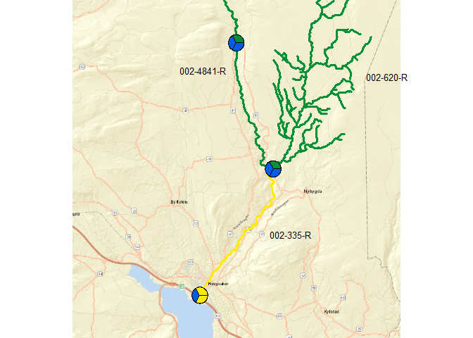
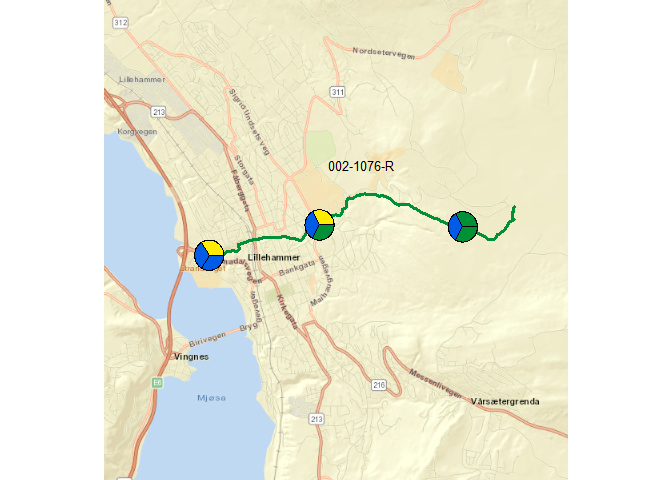
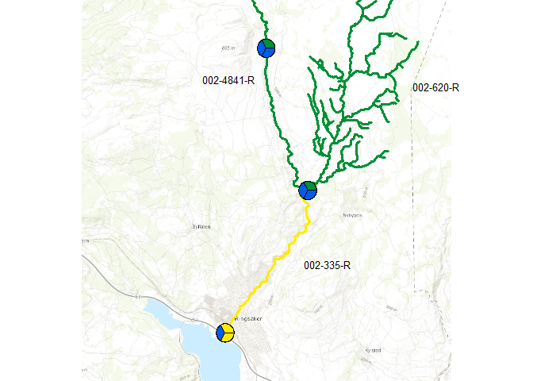

## 1. Libs  

```r
shh <- suppressPackageStartupMessages   # ask packages to please be silent when they load

# Check if purrr is installed (we donæt load it because of namespace collision with maps)
if (!"purrr" %in% installed.packages())
  stop(
    "Please install package 'purrr', for instance by running ",
    dQuote("install.packages('purrr')")
  )

shh(library(OpenStreetMap))
shh(library(maps))
shh(library(ggplot2))
shh(library(readxl))
shh(library(dplyr))
shh(library(sf))

shh(library(jsonlite))  # for fromJSON(), used in get_riverlines

shh(library(plotrix)) # for polygon.shadow() (and more?) 
                                                 #   used in floating.pie()

source("20_4stations_2021_functions.R", encoding = "UTF-8")

# Not strictly necessary:
shh(library(mapview))

# CRS strongs for changing projection
crs_longlat <- "+proj=longlat +ellps=WGS84 +datum=WGS84"
crs_utm <- "+proj=utm +zone=32 +ellps=WGS84 +datum=WGS84 +units=m"
crs_utm33 <- "+proj=utm +zone=33 +ellps=WGS84 +datum=WGS84 +units=m"
```
### Define colours for classes  

```r
# Order in plots etc.
class_levels <- c("Svært dårlig", "Dårlig", "Moderat", "God", "Svært god", "Uklassifisert")

# Read standard colors
df_colors <- read_excel("Data_input/Fargekoder RGB for tilstandsklassifisering.xlsx", sheet = 2) %>%
  mutate(
    Status_no = case_when(
      Status %in% "High" ~ "Svært god",
      Status %in% "Good" ~ "God",
      Status %in% "Moderate" ~ "Moderat",
      Status %in% "Poor" ~ "Dårlig",
      Status %in% "Bad" ~ "Svært dårlig",
      Status %in% "Unclassified" ~ "Uklassifisert"),
    Status_kort = case_when(
      Status %in% "High" ~ "SG",
      Status %in% "Good" ~ "G",
      Status %in% "Moderate" ~ "M",
      Status %in% "Poor" ~ "D",
      Status %in% "Bad" ~ "SD",
      Status %in% "Unclassified" ~ "NA"),
    Status_no = factor(Status_no, levels = class_levels),
    Class_color = rgb(R/255, G/255, B/255)
  ) %>%
  arrange(Status_no)
df_colors
```

```
## # A tibble: 6 x 9
##   EcologicalStatu~    No Status     R     G     B Status_no Status_kort
##   <chr>            <dbl> <chr>  <dbl> <dbl> <dbl> <fct>     <chr>      
## 1 5_Bad                5 Bad      236    28    36 Svært då~ SD         
## 2 4_Poor               4 Poor     242   148     0 Dårlig    D          
## 3 3_Moderate           3 Moder~   255   236     0 Moderat   M          
## 4 2_Good               2 Good       0   144    54 God       G          
## 5 1_High               1 High       0    92   230 Svært god SG         
## 6 U_Unclassified       9 Uncla~   171   167   181 Uklassif~ NA         
## # ... with 1 more variable: Class_color <chr>
```

```r
# Show colors
par(mar = c(0,0,2,0))
pie(rep(1,6), 
    col = df_colors$Class_color, 
    labels = df_colors$Status_no, 
    main = "Colors for nEQr classes")  
```

<!-- -->

```r
# Also make named list
class_colors <- df_colors$Class_color
names(class_colors) <- df_colors$Status_no
```

## 2. Data  

```r
fn <- "C:/Data/seksjon 318/Elveovervakning/Data_input/2021/Klassifisering av økologisk tilstand i elver for rapport 2020.xlsx"
# readxl::excel_sheets(fn)

dat <- read_excel(fn, sheet = "Til Dag ") %>%
  mutate(Lat = as.numeric(Lat),
         Long = as.numeric(Long))

n1 <- nrow(dat)
```

### Add colors to data     
One color column for each of the columns Påvekstalger, HBI, Bunndyr

```r
dat <- dat %>%
  left_join(df_colors %>% select(Status_kort, Class_color) %>% rename(Påvekst_col = Class_color),
            by = c("Påvekstalger" = "Status_kort")) %>%
  left_join(df_colors %>% select(Status_kort, Class_color) %>% rename(HBI_col = Class_color),
            by = c("HBI" = "Status_kort")) %>%
  left_join(df_colors %>% select(Status_kort, Class_color) %>% rename(Bunndyr_col = Class_color),
            by = c("Bunndyr" = "Status_kort"))

n2 <- nrow(dat)

if (n1 != n2)
  stop("Error! number of lines changed!")
```


### Interactive map   
* Only for info  

```r
# For easxy plotting in mapvio 
# For easxy plotting in mapvio 
datsf_longlat <- sf::st_as_sf(
  dat,
  coords = c("Long", "Lat"), 
  crs = crs_longlat, 
  agr = "constant")  

# Transform to UTM
datsf <- st_transform(datsf_longlat, crs_utm)  

# Transform to Web mercator
datsf_wm <- st_transform(datsf_longlat, 3857)  

mapview(datsf_longlat, zcol = "Elv")
```

<!--html_preserve--><div id="htmlwidget-a140ae6eb9fa80ee38a7" style="width:672px;height:480px;" class="leaflet html-widget"></div>
<script type="application/json" data-for="htmlwidget-a140ae6eb9fa80ee38a7">{"x":{"options":{"minZoom":1,"maxZoom":52,"crs":{"crsClass":"L.CRS.EPSG3857","code":null,"proj4def":null,"projectedBounds":null,"options":{}},"preferCanvas":false,"bounceAtZoomLimits":false,"maxBounds":[[[-90,-370]],[[90,370]]]},"calls":[{"method":"addProviderTiles","args":["CartoDB.Positron",1,"CartoDB.Positron",{"errorTileUrl":"","noWrap":false,"detectRetina":false}]},{"method":"addProviderTiles","args":["CartoDB.DarkMatter",2,"CartoDB.DarkMatter",{"errorTileUrl":"","noWrap":false,"detectRetina":false}]},{"method":"addProviderTiles","args":["OpenStreetMap",3,"OpenStreetMap",{"errorTileUrl":"","noWrap":false,"detectRetina":false}]},{"method":"addProviderTiles","args":["Esri.WorldImagery",4,"Esri.WorldImagery",{"errorTileUrl":"","noWrap":false,"detectRetina":false}]},{"method":"addProviderTiles","args":["OpenTopoMap",5,"OpenTopoMap",{"errorTileUrl":"","noWrap":false,"detectRetina":false}]},{"method":"createMapPane","args":["point",440]},{"method":"addCircleMarkers","args":[[60.87902,60.93514,60.991054,60.92177,60.9443718,60.9582014,61.1156,61.1187525,61.1185534,61.15769,61.20913,61.22473],[10.93225,10.9992,10.9655883,10.6965,10.762435,10.7656081,10.4513,10.4751,10.5060025,10.38902,10.27453,10.22788],6,null,"datsf_longlat - Elv",{"crs":{"crsClass":"L.CRS.EPSG3857","code":null,"proj4def":null,"projectedBounds":null,"options":{}},"pane":"point","stroke":true,"color":"#333333","weight":2,"opacity":[0.9,0.9,0.9,0.9,0.9,0.9,0.9,0.9,0.9,0.9,0.9,0.9],"fill":true,"fillColor":["#440154","#440154","#440154","#FDE725","#FDE725","#FDE725","#35B779","#35B779","#35B779","#31688E","#31688E","#31688E"],"fillOpacity":[0.6,0.6,0.6,0.6,0.6,0.6,0.6,0.6,0.6,0.6,0.6,0.6]},null,null,["<html><head><link rel=\"stylesheet\" type=\"text/css\" href=\"lib/popup/popup.css\"><\/head><body><div class=\"scrollableContainer\"><table class=\"popup scrollable\" id=\"popup\"><tr class='coord'><td><\/td><td><b>Feature ID<\/b><\/td><td align='right'>1&emsp;<\/td><\/tr><tr class='alt'><td>1<\/td><td><b>Elv&emsp;<\/b><\/td><td align='right'>Brumunda&emsp;<\/td><\/tr><tr><td>2<\/td><td><b>Stasjonsnavn&emsp;<\/b><\/td><td align='right'>Brumunda, nær utløpet i Mjøsa&emsp;<\/td><\/tr><tr class='alt'><td>3<\/td><td><b>Vannforekomst&emsp;<\/b><\/td><td align='right'>Brumunda, nedre del&emsp;<\/td><\/tr><tr><td>4<\/td><td><b>Vannforekomst ID&emsp;<\/b><\/td><td align='right'>002-335-R&emsp;<\/td><\/tr><tr class='alt'><td>5<\/td><td><b>Påvekstalger&emsp;<\/b><\/td><td align='right'>M&emsp;<\/td><\/tr><tr><td>6<\/td><td><b>HBI&emsp;<\/b><\/td><td align='right'>SG&emsp;<\/td><\/tr><tr class='alt'><td>7<\/td><td><b>Bunndyr&emsp;<\/b><\/td><td align='right'>M&emsp;<\/td><\/tr><tr><td>8<\/td><td><b>Tot-P&emsp;<\/b><\/td><td align='right'>NA&emsp;<\/td><\/tr><tr class='alt'><td>9<\/td><td><b>Samlet&emsp;<\/b><\/td><td align='right'>M&emsp;<\/td><\/tr><tr><td>10<\/td><td><b>Påvekst_col&emsp;<\/b><\/td><td align='right'>#FFEC00&emsp;<\/td><\/tr><tr class='alt'><td>11<\/td><td><b>HBI_col&emsp;<\/b><\/td><td align='right'>#005CE6&emsp;<\/td><\/tr><tr><td>12<\/td><td><b>Bunndyr_col&emsp;<\/b><\/td><td align='right'>#FFEC00&emsp;<\/td><\/tr><tr class='alt'><td>13<\/td><td><b>geometry&emsp;<\/b><\/td><td align='right'>sfc_POINT&emsp;<\/td><\/tr><\/table><\/div><\/body><\/html>","<html><head><link rel=\"stylesheet\" type=\"text/css\" href=\"lib/popup/popup.css\"><\/head><body><div class=\"scrollableContainer\"><table class=\"popup scrollable\" id=\"popup\"><tr class='coord'><td><\/td><td><b>Feature ID<\/b><\/td><td align='right'>2&emsp;<\/td><\/tr><tr class='alt'><td>1<\/td><td><b>Elv&emsp;<\/b><\/td><td align='right'>Brumunda&emsp;<\/td><\/tr><tr><td>2<\/td><td><b>Stasjonsnavn&emsp;<\/b><\/td><td align='right'>Lera ,ved Lera bru&emsp;<\/td><\/tr><tr class='alt'><td>3<\/td><td><b>Vannforekomst&emsp;<\/b><\/td><td align='right'>Lera&emsp;<\/td><\/tr><tr><td>4<\/td><td><b>Vannforekomst ID&emsp;<\/b><\/td><td align='right'>002-620-R&emsp;<\/td><\/tr><tr class='alt'><td>5<\/td><td><b>Påvekstalger&emsp;<\/b><\/td><td align='right'>G&emsp;<\/td><\/tr><tr><td>6<\/td><td><b>HBI&emsp;<\/b><\/td><td align='right'>SG&emsp;<\/td><\/tr><tr class='alt'><td>7<\/td><td><b>Bunndyr&emsp;<\/b><\/td><td align='right'>SG&emsp;<\/td><\/tr><tr><td>8<\/td><td><b>Tot-P&emsp;<\/b><\/td><td align='right'>NA&emsp;<\/td><\/tr><tr class='alt'><td>9<\/td><td><b>Samlet&emsp;<\/b><\/td><td align='right'>G&emsp;<\/td><\/tr><tr><td>10<\/td><td><b>Påvekst_col&emsp;<\/b><\/td><td align='right'>#009036&emsp;<\/td><\/tr><tr class='alt'><td>11<\/td><td><b>HBI_col&emsp;<\/b><\/td><td align='right'>#005CE6&emsp;<\/td><\/tr><tr><td>12<\/td><td><b>Bunndyr_col&emsp;<\/b><\/td><td align='right'>#005CE6&emsp;<\/td><\/tr><tr class='alt'><td>13<\/td><td><b>geometry&emsp;<\/b><\/td><td align='right'>sfc_POINT&emsp;<\/td><\/tr><\/table><\/div><\/body><\/html>","<html><head><link rel=\"stylesheet\" type=\"text/css\" href=\"lib/popup/popup.css\"><\/head><body><div class=\"scrollableContainer\"><table class=\"popup scrollable\" id=\"popup\"><tr class='coord'><td><\/td><td><b>Feature ID<\/b><\/td><td align='right'>3&emsp;<\/td><\/tr><tr class='alt'><td>1<\/td><td><b>Elv&emsp;<\/b><\/td><td align='right'>Brumunda&emsp;<\/td><\/tr><tr><td>2<\/td><td><b>Stasjonsnavn&emsp;<\/b><\/td><td align='right'>Brumunda, nedstrøms Brumund sag&emsp;<\/td><\/tr><tr class='alt'><td>3<\/td><td><b>Vannforekomst&emsp;<\/b><\/td><td align='right'>Brumunda Ljøsåa - Lera&emsp;<\/td><\/tr><tr><td>4<\/td><td><b>Vannforekomst ID&emsp;<\/b><\/td><td align='right'>002-4841-R&emsp;<\/td><\/tr><tr class='alt'><td>5<\/td><td><b>Påvekstalger&emsp;<\/b><\/td><td align='right'>G&emsp;<\/td><\/tr><tr><td>6<\/td><td><b>HBI&emsp;<\/b><\/td><td align='right'>SG&emsp;<\/td><\/tr><tr class='alt'><td>7<\/td><td><b>Bunndyr&emsp;<\/b><\/td><td align='right'>SG&emsp;<\/td><\/tr><tr><td>8<\/td><td><b>Tot-P&emsp;<\/b><\/td><td align='right'>NA&emsp;<\/td><\/tr><tr class='alt'><td>9<\/td><td><b>Samlet&emsp;<\/b><\/td><td align='right'>G&emsp;<\/td><\/tr><tr><td>10<\/td><td><b>Påvekst_col&emsp;<\/b><\/td><td align='right'>#009036&emsp;<\/td><\/tr><tr class='alt'><td>11<\/td><td><b>HBI_col&emsp;<\/b><\/td><td align='right'>#005CE6&emsp;<\/td><\/tr><tr><td>12<\/td><td><b>Bunndyr_col&emsp;<\/b><\/td><td align='right'>#005CE6&emsp;<\/td><\/tr><tr class='alt'><td>13<\/td><td><b>geometry&emsp;<\/b><\/td><td align='right'>sfc_POINT&emsp;<\/td><\/tr><\/table><\/div><\/body><\/html>","<html><head><link rel=\"stylesheet\" type=\"text/css\" href=\"lib/popup/popup.css\"><\/head><body><div class=\"scrollableContainer\"><table class=\"popup scrollable\" id=\"popup\"><tr class='coord'><td><\/td><td><b>Feature ID<\/b><\/td><td align='right'>4&emsp;<\/td><\/tr><tr class='alt'><td>1<\/td><td><b>Elv&emsp;<\/b><\/td><td align='right'>Moelva&emsp;<\/td><\/tr><tr><td>2<\/td><td><b>Stasjonsnavn&emsp;<\/b><\/td><td align='right'>Moelva, nær utløpet i Mjøsa&emsp;<\/td><\/tr><tr class='alt'><td>3<\/td><td><b>Vannforekomst&emsp;<\/b><\/td><td align='right'>Moelva nedstrøms Strand Unikorn&emsp;<\/td><\/tr><tr><td>4<\/td><td><b>Vannforekomst ID&emsp;<\/b><\/td><td align='right'>002-2590-R&emsp;<\/td><\/tr><tr class='alt'><td>5<\/td><td><b>Påvekstalger&emsp;<\/b><\/td><td align='right'>G&emsp;<\/td><\/tr><tr><td>6<\/td><td><b>HBI&emsp;<\/b><\/td><td align='right'>G&emsp;<\/td><\/tr><tr class='alt'><td>7<\/td><td><b>Bunndyr&emsp;<\/b><\/td><td align='right'>SG&emsp;<\/td><\/tr><tr><td>8<\/td><td><b>Tot-P&emsp;<\/b><\/td><td align='right'>NA&emsp;<\/td><\/tr><tr class='alt'><td>9<\/td><td><b>Samlet&emsp;<\/b><\/td><td align='right'>G&emsp;<\/td><\/tr><tr><td>10<\/td><td><b>Påvekst_col&emsp;<\/b><\/td><td align='right'>#009036&emsp;<\/td><\/tr><tr class='alt'><td>11<\/td><td><b>HBI_col&emsp;<\/b><\/td><td align='right'>#009036&emsp;<\/td><\/tr><tr><td>12<\/td><td><b>Bunndyr_col&emsp;<\/b><\/td><td align='right'>#005CE6&emsp;<\/td><\/tr><tr class='alt'><td>13<\/td><td><b>geometry&emsp;<\/b><\/td><td align='right'>sfc_POINT&emsp;<\/td><\/tr><\/table><\/div><\/body><\/html>","<html><head><link rel=\"stylesheet\" type=\"text/css\" href=\"lib/popup/popup.css\"><\/head><body><div class=\"scrollableContainer\"><table class=\"popup scrollable\" id=\"popup\"><tr class='coord'><td><\/td><td><b>Feature ID<\/b><\/td><td align='right'>5&emsp;<\/td><\/tr><tr class='alt'><td>1<\/td><td><b>Elv&emsp;<\/b><\/td><td align='right'>Moelva&emsp;<\/td><\/tr><tr><td>2<\/td><td><b>Stasjonsnavn&emsp;<\/b><\/td><td align='right'>Moelva, nedstrøms samløp koloa&emsp;<\/td><\/tr><tr class='alt'><td>3<\/td><td><b>Vannforekomst&emsp;<\/b><\/td><td align='right'>Moelva inntak Moelv kraftverk - dam nedstrøms utløp Moelv kraftverk&emsp;<\/td><\/tr><tr><td>4<\/td><td><b>Vannforekomst ID&emsp;<\/b><\/td><td align='right'>002-5001-R&emsp;<\/td><\/tr><tr class='alt'><td>5<\/td><td><b>Påvekstalger&emsp;<\/b><\/td><td align='right'>G&emsp;<\/td><\/tr><tr><td>6<\/td><td><b>HBI&emsp;<\/b><\/td><td align='right'>G&emsp;<\/td><\/tr><tr class='alt'><td>7<\/td><td><b>Bunndyr&emsp;<\/b><\/td><td align='right'>SG&emsp;<\/td><\/tr><tr><td>8<\/td><td><b>Tot-P&emsp;<\/b><\/td><td align='right'>NA&emsp;<\/td><\/tr><tr class='alt'><td>9<\/td><td><b>Samlet&emsp;<\/b><\/td><td align='right'>G&emsp;<\/td><\/tr><tr><td>10<\/td><td><b>Påvekst_col&emsp;<\/b><\/td><td align='right'>#009036&emsp;<\/td><\/tr><tr class='alt'><td>11<\/td><td><b>HBI_col&emsp;<\/b><\/td><td align='right'>#009036&emsp;<\/td><\/tr><tr><td>12<\/td><td><b>Bunndyr_col&emsp;<\/b><\/td><td align='right'>#005CE6&emsp;<\/td><\/tr><tr class='alt'><td>13<\/td><td><b>geometry&emsp;<\/b><\/td><td align='right'>sfc_POINT&emsp;<\/td><\/tr><\/table><\/div><\/body><\/html>","<html><head><link rel=\"stylesheet\" type=\"text/css\" href=\"lib/popup/popup.css\"><\/head><body><div class=\"scrollableContainer\"><table class=\"popup scrollable\" id=\"popup\"><tr class='coord'><td><\/td><td><b>Feature ID<\/b><\/td><td align='right'>6&emsp;<\/td><\/tr><tr class='alt'><td>1<\/td><td><b>Elv&emsp;<\/b><\/td><td align='right'>Moelva&emsp;<\/td><\/tr><tr><td>2<\/td><td><b>Stasjonsnavn&emsp;<\/b><\/td><td align='right'>Moelva, nedstrøms Haga bruk&emsp;<\/td><\/tr><tr class='alt'><td>3<\/td><td><b>Vannforekomst&emsp;<\/b><\/td><td align='right'>Moelva, øvre del&emsp;<\/td><\/tr><tr><td>4<\/td><td><b>Vannforekomst ID&emsp;<\/b><\/td><td align='right'>002-1002-R&emsp;<\/td><\/tr><tr class='alt'><td>5<\/td><td><b>Påvekstalger&emsp;<\/b><\/td><td align='right'>G&emsp;<\/td><\/tr><tr><td>6<\/td><td><b>HBI&emsp;<\/b><\/td><td align='right'>SG&emsp;<\/td><\/tr><tr class='alt'><td>7<\/td><td><b>Bunndyr&emsp;<\/b><\/td><td align='right'>SG&emsp;<\/td><\/tr><tr><td>8<\/td><td><b>Tot-P&emsp;<\/b><\/td><td align='right'>NA&emsp;<\/td><\/tr><tr class='alt'><td>9<\/td><td><b>Samlet&emsp;<\/b><\/td><td align='right'>G&emsp;<\/td><\/tr><tr><td>10<\/td><td><b>Påvekst_col&emsp;<\/b><\/td><td align='right'>#009036&emsp;<\/td><\/tr><tr class='alt'><td>11<\/td><td><b>HBI_col&emsp;<\/b><\/td><td align='right'>#005CE6&emsp;<\/td><\/tr><tr><td>12<\/td><td><b>Bunndyr_col&emsp;<\/b><\/td><td align='right'>#005CE6&emsp;<\/td><\/tr><tr class='alt'><td>13<\/td><td><b>geometry&emsp;<\/b><\/td><td align='right'>sfc_POINT&emsp;<\/td><\/tr><\/table><\/div><\/body><\/html>","<html><head><link rel=\"stylesheet\" type=\"text/css\" href=\"lib/popup/popup.css\"><\/head><body><div class=\"scrollableContainer\"><table class=\"popup scrollable\" id=\"popup\"><tr class='coord'><td><\/td><td><b>Feature ID<\/b><\/td><td align='right'>7&emsp;<\/td><\/tr><tr class='alt'><td>1<\/td><td><b>Elv&emsp;<\/b><\/td><td align='right'>Mesna&emsp;<\/td><\/tr><tr><td>2<\/td><td><b>Stasjonsnavn&emsp;<\/b><\/td><td align='right'>Mesna, nær utløpet i Mjøsa&emsp;<\/td><\/tr><tr class='alt'><td>3<\/td><td><b>Vannforekomst&emsp;<\/b><\/td><td align='right'>Mesnaelva, fra Kroken og ned&emsp;<\/td><\/tr><tr><td>4<\/td><td><b>Vannforekomst ID&emsp;<\/b><\/td><td align='right'>002-1076-R&emsp;<\/td><\/tr><tr class='alt'><td>5<\/td><td><b>Påvekstalger&emsp;<\/b><\/td><td align='right'>M&emsp;<\/td><\/tr><tr><td>6<\/td><td><b>HBI&emsp;<\/b><\/td><td align='right'>SG&emsp;<\/td><\/tr><tr class='alt'><td>7<\/td><td><b>Bunndyr&emsp;<\/b><\/td><td align='right'>SG&emsp;<\/td><\/tr><tr><td>8<\/td><td><b>Tot-P&emsp;<\/b><\/td><td align='right'>NA&emsp;<\/td><\/tr><tr class='alt'><td>9<\/td><td><b>Samlet&emsp;<\/b><\/td><td align='right'>M&emsp;<\/td><\/tr><tr><td>10<\/td><td><b>Påvekst_col&emsp;<\/b><\/td><td align='right'>#FFEC00&emsp;<\/td><\/tr><tr class='alt'><td>11<\/td><td><b>HBI_col&emsp;<\/b><\/td><td align='right'>#005CE6&emsp;<\/td><\/tr><tr><td>12<\/td><td><b>Bunndyr_col&emsp;<\/b><\/td><td align='right'>#005CE6&emsp;<\/td><\/tr><tr class='alt'><td>13<\/td><td><b>geometry&emsp;<\/b><\/td><td align='right'>sfc_POINT&emsp;<\/td><\/tr><\/table><\/div><\/body><\/html>","<html><head><link rel=\"stylesheet\" type=\"text/css\" href=\"lib/popup/popup.css\"><\/head><body><div class=\"scrollableContainer\"><table class=\"popup scrollable\" id=\"popup\"><tr class='coord'><td><\/td><td><b>Feature ID<\/b><\/td><td align='right'>8&emsp;<\/td><\/tr><tr class='alt'><td>1<\/td><td><b>Elv&emsp;<\/b><\/td><td align='right'>Mesna&emsp;<\/td><\/tr><tr><td>2<\/td><td><b>Stasjonsnavn&emsp;<\/b><\/td><td align='right'>Mesna, ved gangbru, Åveitbakken&emsp;<\/td><\/tr><tr class='alt'><td>3<\/td><td><b>Vannforekomst&emsp;<\/b><\/td><td align='right'>Mesnaelva, fra Kroken og ned&emsp;<\/td><\/tr><tr><td>4<\/td><td><b>Vannforekomst ID&emsp;<\/b><\/td><td align='right'>002-1076-R&emsp;<\/td><\/tr><tr class='alt'><td>5<\/td><td><b>Påvekstalger&emsp;<\/b><\/td><td align='right'>M&emsp;<\/td><\/tr><tr><td>6<\/td><td><b>HBI&emsp;<\/b><\/td><td align='right'>SG&emsp;<\/td><\/tr><tr class='alt'><td>7<\/td><td><b>Bunndyr&emsp;<\/b><\/td><td align='right'>G&emsp;<\/td><\/tr><tr><td>8<\/td><td><b>Tot-P&emsp;<\/b><\/td><td align='right'>NA&emsp;<\/td><\/tr><tr class='alt'><td>9<\/td><td><b>Samlet&emsp;<\/b><\/td><td align='right'>M&emsp;<\/td><\/tr><tr><td>10<\/td><td><b>Påvekst_col&emsp;<\/b><\/td><td align='right'>#FFEC00&emsp;<\/td><\/tr><tr class='alt'><td>11<\/td><td><b>HBI_col&emsp;<\/b><\/td><td align='right'>#005CE6&emsp;<\/td><\/tr><tr><td>12<\/td><td><b>Bunndyr_col&emsp;<\/b><\/td><td align='right'>#009036&emsp;<\/td><\/tr><tr class='alt'><td>13<\/td><td><b>geometry&emsp;<\/b><\/td><td align='right'>sfc_POINT&emsp;<\/td><\/tr><\/table><\/div><\/body><\/html>","<html><head><link rel=\"stylesheet\" type=\"text/css\" href=\"lib/popup/popup.css\"><\/head><body><div class=\"scrollableContainer\"><table class=\"popup scrollable\" id=\"popup\"><tr class='coord'><td><\/td><td><b>Feature ID<\/b><\/td><td align='right'>9&emsp;<\/td><\/tr><tr class='alt'><td>1<\/td><td><b>Elv&emsp;<\/b><\/td><td align='right'>Mesna&emsp;<\/td><\/tr><tr><td>2<\/td><td><b>Stasjonsnavn&emsp;<\/b><\/td><td align='right'>Mesna, sør for Skrefsrud&emsp;<\/td><\/tr><tr class='alt'><td>3<\/td><td><b>Vannforekomst&emsp;<\/b><\/td><td align='right'>Mesnaelva, fra Kroken og ned&emsp;<\/td><\/tr><tr><td>4<\/td><td><b>Vannforekomst ID&emsp;<\/b><\/td><td align='right'>002-1076-R&emsp;<\/td><\/tr><tr class='alt'><td>5<\/td><td><b>Påvekstalger&emsp;<\/b><\/td><td align='right'>G&emsp;<\/td><\/tr><tr><td>6<\/td><td><b>HBI&emsp;<\/b><\/td><td align='right'>SG&emsp;<\/td><\/tr><tr class='alt'><td>7<\/td><td><b>Bunndyr&emsp;<\/b><\/td><td align='right'>G&emsp;<\/td><\/tr><tr><td>8<\/td><td><b>Tot-P&emsp;<\/b><\/td><td align='right'>NA&emsp;<\/td><\/tr><tr class='alt'><td>9<\/td><td><b>Samlet&emsp;<\/b><\/td><td align='right'>G&emsp;<\/td><\/tr><tr><td>10<\/td><td><b>Påvekst_col&emsp;<\/b><\/td><td align='right'>#009036&emsp;<\/td><\/tr><tr class='alt'><td>11<\/td><td><b>HBI_col&emsp;<\/b><\/td><td align='right'>#005CE6&emsp;<\/td><\/tr><tr><td>12<\/td><td><b>Bunndyr_col&emsp;<\/b><\/td><td align='right'>#009036&emsp;<\/td><\/tr><tr class='alt'><td>13<\/td><td><b>geometry&emsp;<\/b><\/td><td align='right'>sfc_POINT&emsp;<\/td><\/tr><\/table><\/div><\/body><\/html>","<html><head><link rel=\"stylesheet\" type=\"text/css\" href=\"lib/popup/popup.css\"><\/head><body><div class=\"scrollableContainer\"><table class=\"popup scrollable\" id=\"popup\"><tr class='coord'><td><\/td><td><b>Feature ID<\/b><\/td><td align='right'>10&emsp;<\/td><\/tr><tr class='alt'><td>1<\/td><td><b>Elv&emsp;<\/b><\/td><td align='right'>Gausa&emsp;<\/td><\/tr><tr><td>2<\/td><td><b>Stasjonsnavn&emsp;<\/b><\/td><td align='right'>Gausa, nær utløp i Lågen&emsp;<\/td><\/tr><tr class='alt'><td>3<\/td><td><b>Vannforekomst&emsp;<\/b><\/td><td align='right'>Gausa Follebu bruk - Lågen&emsp;<\/td><\/tr><tr><td>4<\/td><td><b>Vannforekomst ID&emsp;<\/b><\/td><td align='right'>002-4723-R&emsp;<\/td><\/tr><tr class='alt'><td>5<\/td><td><b>Påvekstalger&emsp;<\/b><\/td><td align='right'>SG&emsp;<\/td><\/tr><tr><td>6<\/td><td><b>HBI&emsp;<\/b><\/td><td align='right'>SG&emsp;<\/td><\/tr><tr class='alt'><td>7<\/td><td><b>Bunndyr&emsp;<\/b><\/td><td align='right'>SG&emsp;<\/td><\/tr><tr><td>8<\/td><td><b>Tot-P&emsp;<\/b><\/td><td align='right'>NA&emsp;<\/td><\/tr><tr class='alt'><td>9<\/td><td><b>Samlet&emsp;<\/b><\/td><td align='right'>SG&emsp;<\/td><\/tr><tr><td>10<\/td><td><b>Påvekst_col&emsp;<\/b><\/td><td align='right'>#005CE6&emsp;<\/td><\/tr><tr class='alt'><td>11<\/td><td><b>HBI_col&emsp;<\/b><\/td><td align='right'>#005CE6&emsp;<\/td><\/tr><tr><td>12<\/td><td><b>Bunndyr_col&emsp;<\/b><\/td><td align='right'>#005CE6&emsp;<\/td><\/tr><tr class='alt'><td>13<\/td><td><b>geometry&emsp;<\/b><\/td><td align='right'>sfc_POINT&emsp;<\/td><\/tr><\/table><\/div><\/body><\/html>","<html><head><link rel=\"stylesheet\" type=\"text/css\" href=\"lib/popup/popup.css\"><\/head><body><div class=\"scrollableContainer\"><table class=\"popup scrollable\" id=\"popup\"><tr class='coord'><td><\/td><td><b>Feature ID<\/b><\/td><td align='right'>11&emsp;<\/td><\/tr><tr class='alt'><td>1<\/td><td><b>Elv&emsp;<\/b><\/td><td align='right'>Gausa&emsp;<\/td><\/tr><tr><td>2<\/td><td><b>Stasjonsnavn&emsp;<\/b><\/td><td align='right'>Gausa, Moavika&emsp;<\/td><\/tr><tr class='alt'><td>3<\/td><td><b>Vannforekomst&emsp;<\/b><\/td><td align='right'>Gausa Follebu bruk - Lågen&emsp;<\/td><\/tr><tr><td>4<\/td><td><b>Vannforekomst ID&emsp;<\/b><\/td><td align='right'>002-4723-R&emsp;<\/td><\/tr><tr class='alt'><td>5<\/td><td><b>Påvekstalger&emsp;<\/b><\/td><td align='right'>SG&emsp;<\/td><\/tr><tr><td>6<\/td><td><b>HBI&emsp;<\/b><\/td><td align='right'>SG&emsp;<\/td><\/tr><tr class='alt'><td>7<\/td><td><b>Bunndyr&emsp;<\/b><\/td><td align='right'>SG&emsp;<\/td><\/tr><tr><td>8<\/td><td><b>Tot-P&emsp;<\/b><\/td><td align='right'>NA&emsp;<\/td><\/tr><tr class='alt'><td>9<\/td><td><b>Samlet&emsp;<\/b><\/td><td align='right'>SG&emsp;<\/td><\/tr><tr><td>10<\/td><td><b>Påvekst_col&emsp;<\/b><\/td><td align='right'>#005CE6&emsp;<\/td><\/tr><tr class='alt'><td>11<\/td><td><b>HBI_col&emsp;<\/b><\/td><td align='right'>#005CE6&emsp;<\/td><\/tr><tr><td>12<\/td><td><b>Bunndyr_col&emsp;<\/b><\/td><td align='right'>#005CE6&emsp;<\/td><\/tr><tr class='alt'><td>13<\/td><td><b>geometry&emsp;<\/b><\/td><td align='right'>sfc_POINT&emsp;<\/td><\/tr><\/table><\/div><\/body><\/html>","<html><head><link rel=\"stylesheet\" type=\"text/css\" href=\"lib/popup/popup.css\"><\/head><body><div class=\"scrollableContainer\"><table class=\"popup scrollable\" id=\"popup\"><tr class='coord'><td><\/td><td><b>Feature ID<\/b><\/td><td align='right'>12&emsp;<\/td><\/tr><tr class='alt'><td>1<\/td><td><b>Elv&emsp;<\/b><\/td><td align='right'>Gausa&emsp;<\/td><\/tr><tr><td>2<\/td><td><b>Stasjonsnavn&emsp;<\/b><\/td><td align='right'>Gausa, ved Steinsmoen&emsp;<\/td><\/tr><tr class='alt'><td>3<\/td><td><b>Vannforekomst&emsp;<\/b><\/td><td align='right'>Vesleelva&emsp;<\/td><\/tr><tr><td>4<\/td><td><b>Vannforekomst ID&emsp;<\/b><\/td><td align='right'>002-2325-R&emsp;<\/td><\/tr><tr class='alt'><td>5<\/td><td><b>Påvekstalger&emsp;<\/b><\/td><td align='right'>M&emsp;<\/td><\/tr><tr><td>6<\/td><td><b>HBI&emsp;<\/b><\/td><td align='right'>G&emsp;<\/td><\/tr><tr class='alt'><td>7<\/td><td><b>Bunndyr&emsp;<\/b><\/td><td align='right'>SG&emsp;<\/td><\/tr><tr><td>8<\/td><td><b>Tot-P&emsp;<\/b><\/td><td align='right'>SG&emsp;<\/td><\/tr><tr class='alt'><td>9<\/td><td><b>Samlet&emsp;<\/b><\/td><td align='right'>M&emsp;<\/td><\/tr><tr><td>10<\/td><td><b>Påvekst_col&emsp;<\/b><\/td><td align='right'>#FFEC00&emsp;<\/td><\/tr><tr class='alt'><td>11<\/td><td><b>HBI_col&emsp;<\/b><\/td><td align='right'>#009036&emsp;<\/td><\/tr><tr><td>12<\/td><td><b>Bunndyr_col&emsp;<\/b><\/td><td align='right'>#005CE6&emsp;<\/td><\/tr><tr class='alt'><td>13<\/td><td><b>geometry&emsp;<\/b><\/td><td align='right'>sfc_POINT&emsp;<\/td><\/tr><\/table><\/div><\/body><\/html>"],{"maxWidth":800,"minWidth":50,"autoPan":true,"keepInView":false,"closeButton":true,"closeOnClick":true,"className":""},["Brumunda","Brumunda","Brumunda","Moelva","Moelva","Moelva","Mesna","Mesna","Mesna","Gausa","Gausa","Gausa"],{"interactive":false,"permanent":false,"direction":"auto","opacity":1,"offset":[0,0],"textsize":"10px","textOnly":false,"className":"","sticky":true},null]},{"method":"addScaleBar","args":[{"maxWidth":100,"metric":true,"imperial":true,"updateWhenIdle":true,"position":"bottomleft"}]},{"method":"addHomeButton","args":[10.22788,60.87902,10.9992,61.22473,"datsf_longlat - Elv","Zoom to datsf_longlat - Elv","<strong> datsf_longlat - Elv <\/strong>","bottomright"]},{"method":"addLayersControl","args":[["CartoDB.Positron","CartoDB.DarkMatter","OpenStreetMap","Esri.WorldImagery","OpenTopoMap"],"datsf_longlat - Elv",{"collapsed":true,"autoZIndex":true,"position":"topleft"}]},{"method":"addLegend","args":[{"colors":["#440154","#31688E","#35B779","#FDE725"],"labels":["Brumunda","Gausa","Mesna","Moelva"],"na_color":null,"na_label":"NA","opacity":1,"position":"topright","type":"factor","title":"datsf_longlat - Elv","extra":null,"layerId":null,"className":"info legend","group":"datsf_longlat - Elv"}]}],"limits":{"lat":[60.87902,61.22473],"lng":[10.22788,10.9992]}},"evals":[],"jsHooks":{"render":[{"code":"function(el, x, data) {\n  return (\n      function(el, x, data) {\n      // get the leaflet map\n      var map = this; //HTMLWidgets.find('#' + el.id);\n      // we need a new div element because we have to handle\n      // the mouseover output separately\n      // debugger;\n      function addElement () {\n      // generate new div Element\n      var newDiv = $(document.createElement('div'));\n      // append at end of leaflet htmlwidget container\n      $(el).append(newDiv);\n      //provide ID and style\n      newDiv.addClass('lnlt');\n      newDiv.css({\n      'position': 'relative',\n      'bottomleft':  '0px',\n      'background-color': 'rgba(255, 255, 255, 0.7)',\n      'box-shadow': '0 0 2px #bbb',\n      'background-clip': 'padding-box',\n      'margin': '0',\n      'padding-left': '5px',\n      'color': '#333',\n      'font': '9px/1.5 \"Helvetica Neue\", Arial, Helvetica, sans-serif',\n      'z-index': '700',\n      });\n      return newDiv;\n      }\n\n\n      // check for already existing lnlt class to not duplicate\n      var lnlt = $(el).find('.lnlt');\n\n      if(!lnlt.length) {\n      lnlt = addElement();\n\n      // grab the special div we generated in the beginning\n      // and put the mousmove output there\n\n      map.on('mousemove', function (e) {\n      if (e.originalEvent.ctrlKey) {\n      if (document.querySelector('.lnlt') === null) lnlt = addElement();\n      lnlt.text(\n                           ' lon: ' + (e.latlng.lng).toFixed(5) +\n                           ' | lat: ' + (e.latlng.lat).toFixed(5) +\n                           ' | zoom: ' + map.getZoom() +\n                           ' | x: ' + L.CRS.EPSG3857.project(e.latlng).x.toFixed(0) +\n                           ' | y: ' + L.CRS.EPSG3857.project(e.latlng).y.toFixed(0) +\n                           ' | epsg: 3857 ' +\n                           ' | proj4: +proj=merc +a=6378137 +b=6378137 +lat_ts=0.0 +lon_0=0.0 +x_0=0.0 +y_0=0 +k=1.0 +units=m +nadgrids=@null +no_defs ');\n      } else {\n      if (document.querySelector('.lnlt') === null) lnlt = addElement();\n      lnlt.text(\n                      ' lon: ' + (e.latlng.lng).toFixed(5) +\n                      ' | lat: ' + (e.latlng.lat).toFixed(5) +\n                      ' | zoom: ' + map.getZoom() + ' ');\n      }\n      });\n\n      // remove the lnlt div when mouse leaves map\n      map.on('mouseout', function (e) {\n      var strip = document.querySelector('.lnlt');\n      if( strip !==null) strip.remove();\n      });\n\n      };\n\n      //$(el).keypress(67, function(e) {\n      map.on('preclick', function(e) {\n      if (e.originalEvent.ctrlKey) {\n      if (document.querySelector('.lnlt') === null) lnlt = addElement();\n      lnlt.text(\n                      ' lon: ' + (e.latlng.lng).toFixed(5) +\n                      ' | lat: ' + (e.latlng.lat).toFixed(5) +\n                      ' | zoom: ' + map.getZoom() + ' ');\n      var txt = document.querySelector('.lnlt').textContent;\n      console.log(txt);\n      //txt.innerText.focus();\n      //txt.select();\n      setClipboardText('\"' + txt + '\"');\n      }\n      });\n\n      }\n      ).call(this.getMap(), el, x, data);\n}","data":null}]}}</script><!--/html_preserve-->


## 3. Openstreetmap {.tabset}


### Moelva  


```r
plot_river2("Moelva", dlon = 0.10, dlat = 0.05, radius = 300, 
            id_pos = c("left", "right", "right"),
            id_distance = 250, 
            data = dat,
            maptype = "osm")
```

<!-- -->

### Brumunda    


```r
plot_river2("Brumunda", dlon = 0.30, dlat = 0.15, radius = 800, 
            id_pos = c("right", "left", "right"),
            id_distance = -500, 
            data = dat,
            maptype = "osm")
```

<!-- -->

### Gausa    


```r
plot_river2("Gausa", dlon = 0.30, dlat = 0.15, radius = 900, 
            id_pos = c("below", "below"),
            id_distance = c(0, 200), 
            data = dat,
            maptype = "osm")
```

<!-- -->

### Mesna    


```r
plot_river2("Mesna", dlon = 0.10, dlat = 0.05, radius = 350,
            id_pos = "above", 
            id_distance = 700, 
            data = dat,
            maptype = "osm")
```

<!-- -->


## 4. ESRI {.tabset}


### Moelva  


```r
plot_river2("Moelva", dlon = 0.10, dlat = 0.05, radius = 300, 
            id_pos = c("left", "right", "right"),
            id_distance = 250, 
            data = dat,
            maptype = "esri")
```

<!-- -->

### Brumunda    


```r
plot_river2("Brumunda", dlon = 0.30, dlat = 0.15, radius = 800, 
            id_pos = c("right", "left", "right"),
            id_distance = -500, 
            data = dat,
            maptype = "esri")
```

<!-- -->

### Gausa    


```r
plot_river2("Gausa", dlon = 0.30, dlat = 0.15, radius = 900, 
            id_pos = c("below", "below"),
            id_distance = c(0, 200), 
            data = dat,
            maptype = "esri")
```

<!-- -->

### Mesna    


```r
plot_river2("Mesna", dlon = 0.10, dlat = 0.05, radius = 350,
            id_pos = "above", 
            id_distance = 700, 
            data = dat,
            maptype = "esri")
```

<!-- -->


## 5. ESRI-topo {.tabset}


### Moelva  


```r
plot_river2("Moelva", dlon = 0.10, dlat = 0.05, radius = 300, 
            id_pos = c("left", "right", "right"),
            id_distance = 250, 
            data = dat,
            maptype = "esri-topo")
```

<!-- -->

### Brumunda    


```r
plot_river2("Brumunda", dlon = 0.30, dlat = 0.15, radius = 800, 
            id_pos = c("right", "left", "right"),
            id_distance = -500, 
            data = dat,
            maptype = "esri-topo")
```

<!-- -->

### Gausa    


```r
plot_river2("Gausa", dlon = 0.30, dlat = 0.15, radius = 900, 
            id_pos = c("below", "below"),
            id_distance = c(0, 200), 
            data = dat,
            maptype = "esri-topo")
```

<!-- -->

### Mesna    


```r
plot_river2("Mesna", dlon = 0.10, dlat = 0.05, radius = 350,
            id_pos = "above", 
            id_distance = 700, 
            data = dat,
            maptype = "esri-topo")
```

<!-- -->


## 6. apple-iphoto {.tabset}


### Moelva  


```r
plot_river2("Moelva", dlon = 0.10, dlat = 0.05, radius = 300, 
            id_pos = c("left", "right", "right"),
            id_distance = 250, 
            data = dat,
            maptype = "apple-iphoto")
```

<!-- -->

### Brumunda    


```r
plot_river2("Brumunda", dlon = 0.30, dlat = 0.15, radius = 800, 
            id_pos = c("right", "left", "right"),
            id_distance = -500, 
            data = dat,
            maptype = "apple-iphoto")
```

<!-- -->

### Gausa    


```r
plot_river2("Gausa", dlon = 0.30, dlat = 0.15, radius = 900, 
            id_pos = c("below", "below"),
            id_distance = c(0, 200), 
            data = dat,
            maptype = "apple-iphoto")
```

<!-- -->

### Mesna    


```r
plot_river2("Mesna", dlon = 0.10, dlat = 0.05, radius = 350,
            id_pos = "above", 
            id_distance = 700, 
            data = dat,
            maptype = "apple-iphoto")
```

<!-- -->


## 7. bing {.tabset}


### Moelva  


```r
plot_river2("Moelva", dlon = 0.10, dlat = 0.05, radius = 300, 
            id_pos = c("left", "right", "right"),
            id_distance = 250, 
            data = dat,
            maptype = "bing")
```

<!-- -->

### Brumunda    


```r
plot_river2("Brumunda", dlon = 0.30, dlat = 0.15, radius = 800, 
            id_pos = c("right", "left", "right"),
            id_distance = -500, 
            data = dat,
            maptype = "bing")
```

<!-- -->

### Gausa    


```r
plot_river2("Gausa", dlon = 0.30, dlat = 0.15, radius = 900, 
            id_pos = c("below", "below"),
            id_distance = c(0, 200), 
            data = dat,
            maptype = "bing")
```

<!-- -->

### Mesna    


```r
plot_river2("Mesna", dlon = 0.10, dlat = 0.05, radius = 350,
            id_pos = "above", 
            id_distance = 700, 
            data = dat,
            maptype = "bing")
```

<!-- -->

