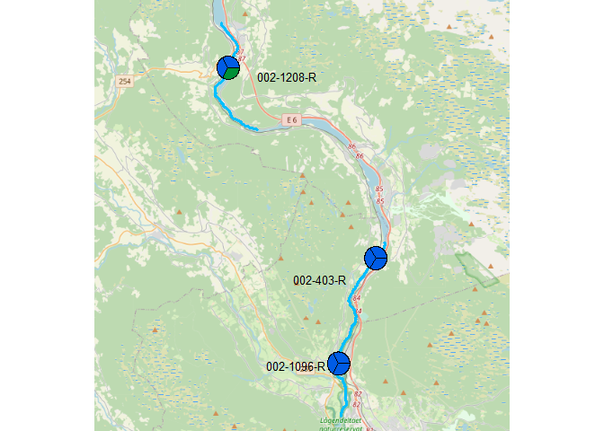

## 1. Libs  

```r
shh <- suppressPackageStartupMessages   # ask packages to please be silent when they load

# Check if purrr is installed (we donæt load it because of namespace collision with maps)
if (!"purrr" %in% installed.packages())
  stop(
    "Please install package 'purrr', for instance by running ",
    dQuote("install.packages('purrr')")
  )

shh(library(OpenStreetMap))
shh(library(maps))
shh(library(ggplot2))
shh(library(readxl))
shh(library(dplyr))
shh(library(sf))

shh(library(jsonlite))  # for fromJSON(), used in get_riverlines

shh(library(plotrix)) # for polygon.shadow() (and more?) 
                                                 #   used in floating.pie()

source("20_4stations_2021_functions.R", encoding = "UTF-8")

# Not strictly necessary:
shh(library(mapview))

# CRS strongs for changing projection
crs_longlat <- "+proj=longlat +ellps=WGS84 +datum=WGS84"
crs_utm <- "+proj=utm +zone=32 +ellps=WGS84 +datum=WGS84 +units=m"
crs_utm33 <- "+proj=utm +zone=33 +ellps=WGS84 +datum=WGS84 +units=m"
```


### Save figures

```r
# save_figures <- TRUE
save_figures <- FALSE
```


### Define colours for classes  


```r
# Order in plots etc.
class_levels <- c("Svært dårlig", "Dårlig", "Moderat", "God", "Svært god", "Uklassifisert")

# Read standard colors
df_colors <- read_excel("Data_input/Fargekoder RGB for tilstandsklassifisering.xlsx", sheet = 2) %>%
  mutate(
    Status_no = case_when(
      Status %in% "High" ~ "Svært god",
      Status %in% "Good" ~ "God",
      Status %in% "Moderate" ~ "Moderat",
      Status %in% "Poor" ~ "Dårlig",
      Status %in% "Bad" ~ "Svært dårlig",
      Status %in% "Unclassified" ~ "Uklassifisert"),
    Status_kort = case_when(
      Status %in% "High" ~ "SG",
      Status %in% "Good" ~ "G",
      Status %in% "Moderate" ~ "M",
      Status %in% "Poor" ~ "D",
      Status %in% "Bad" ~ "SD",
      Status %in% "Unclassified" ~ "NA"),
    Status_no = factor(Status_no, levels = class_levels),
    Class_color = rgb(R/255, G/255, B/255)
  ) %>%
  arrange(Status_no)
df_colors
```

```
## # A tibble: 6 x 9
##   EcologicalStatusID    No Status           R     G     B Status_no  Status_kort
##   <chr>              <dbl> <chr>        <dbl> <dbl> <dbl> <fct>      <chr>      
## 1 5_Bad                  5 Bad            236    28    36 Svært dår~ SD         
## 2 4_Poor                 4 Poor           242   148     0 Dårlig     D          
## 3 3_Moderate             3 Moderate       255   236     0 Moderat    M          
## 4 2_Good                 2 Good             0   144    54 God        G          
## 5 1_High                 1 High             0    92   230 Svært god  SG         
## 6 U_Unclassified         9 Unclassified   171   167   181 Uklassifi~ NA         
## # ... with 1 more variable: Class_color <chr>
```

```r
# Show colors
par(mar = c(0,0,2,0))
pie(rep(1,6), 
    col = df_colors$Class_color, 
    labels = df_colors$Status_no, 
    main = "Colors for nEQr classes")  
```

<!-- -->

```r
# Also make named list
class_colors <- df_colors$Class_color
names(class_colors) <- df_colors$Status_no
```

### For the legend    
Copy-pasted to Powerpoint file and modified there  

```r
# Using a modified version of pie() where 'lwd' (line width) works
pie(rep(1,3), col = "white", label = "", lwd = 2)  
```

<!-- -->

```r
gg <- df_colors %>%
  mutate(X = 1,
         Status_no = forcats::fct_rev(Status_no)) %>%
  ggplot(aes(x = Status_no, y = X, fill = Status_no)) +
  geom_col() +
  scale_fill_manual(values = rev(df_colors$Class_color)) 

cowplot::plot_grid(
  cowplot::get_legend(gg)
  )
```

<!-- -->


## 2. Data  

```r
# 2021
fn <- "C:/Data/seksjon 318/Elveovervakning/Data_input/2021/Klassifisering av økologisk tilstand i elver for rapport 2020.xlsx"

# 2022
fn <- "C:/Data/seksjon 318/Elveovervakning/Data_input/2022/Vanntyper og punching av indeksverdier.xlsx"
# readxl::excel_sheets(fn)

dat <- read_excel(fn) %>%
  mutate(Lat = as.numeric(`Breddegrad, nord`),
         Long = as.numeric(`Lengdegrad, øst`))
```

```
## New names:
## * PIT -> PIT...16
## * `nEQR PIT` -> `nEQR PIT...17`
## * AIP -> AIP...18
## * `nEQR AIP` -> `nEQR AIP...19`
## * PIT -> PIT...20
## * ...
```

```r
n1 <- nrow(dat)

# Column names hard-coded in functions
dat <- dat %>%
  rename(`Vannforekomst ID` = `Vann-forekomst-ID`)


# For this purpose, we use "Samlet" for the quality of the entire Vannforekomst (not on station level)
# So we set it to "God" for Mesna (following mean of nEQR, not shown here)

# 2022: SKIP THIS SO FAR

# dat <- dat %>%
#   mutate(Samlet = case_when(
#     Elv == "Mesna" ~ "G",
#     TRUE ~ Samlet
#   ))
```


```r
# > str(dat)
# tibble [12 x 11] (S3: tbl_df/tbl/data.frame)
#  $ Elv             : chr [1:12] "Brumunda" "Brumunda" "Brumunda" "Moelva" ...
#  $ Stasjonsnavn    : chr [1:12] "Brumunda, nær utløpet i Mjøsa" "Lera ,ved Lera bru" "Brumunda, nedstrøms Brumund sag" ...
#  $ Lat             : num [1:12] 60.9 60.9 61 60.9 60.9 ...
#  $ Long            : num [1:12] 10.9 11 11 10.7 10.8 ...
#  $ Vannforekomst   : chr [1:12] "Brumunda, nedre del" "Lera" "Brumunda Ljøsåa - Lera" "Moelva nedstrøms Strand Unikorn" ...
#  $ Vannforekomst ID: chr [1:12] "002-335-R" "002-620-R" "002-4841-R" "002-2590-R" ...
#  $ Påvekstalger    : chr [1:12] "M" "G" "G" "G" ...
#  $ HBI             : chr [1:12] "SG" "SG" "SG" "G" ...
#  $ Bunndyr         : chr [1:12] "M" "SG" "SG" "SG" ...
#  $ Tot-P           : chr [1:12] "NA" "NA" "NA" "NA" ...
#  $ Samlet          : chr [1:12] "M" "G" "G" "G" ...
```


### Add colors to data     
One color column for each of the columns Påvekstalger, HBI, Bunndyr
* Note: PIT = index for Påvekstalger (see Veileder 02-2018 page 20)   
* Note: HBI = index for Påvekstalger (see Veileder 02-2018 page 60)      

```r
# 2021 version - status given as SG, G, M
# dat <- dat %>%
#   left_join(df_colors %>% select(Status_kort, Class_color) %>% rename(Påvekst_col = Class_color),
#             by = c("Tilstand PIT" = "Status_kort")) %>%
#   left_join(df_colors %>% select(Status_kort, Class_color) %>% rename(HBI_col = Class_color),
#             by = c("Tilstand HBI2" = "Status_kort")) %>%
#   left_join(df_colors %>% select(Status_kort, Class_color) %>% rename(Bunndyr_col = Class_color),
#             by = c("Bunndyr" = "Status_kort")) %>%
#   left_join(df_colors %>% select(Status_kort, Class_color) %>% rename(Combined_col = Class_color),
#             by = c("Samlet" = "Status_kort"))  

# 2022 version - status given as Svært god, God, Moderat
dat <- dat %>%
  left_join(df_colors %>% select(Status_no, Class_color) %>% rename(Påvekst_col = Class_color),
            by = c("Tilstand PIT" = "Status_no")) %>%
  left_join(df_colors %>% select(Status_no, Class_color) %>% rename(HBI_col = Class_color),
            by = c("Tilstand HBI2" = "Status_no")) %>%
  left_join(df_colors %>% select(Status_no, Class_color) %>% rename(Bunndyr_col = Class_color),
            by = c("Tilstand HBI2" = "Status_no")) %>%
  left_join(df_colors %>% select(Status_no, Class_color) %>% rename(Combined_col = Class_color),
            by = c("Tilstand HBI2" = "Status_no"))  

n2 <- nrow(dat)

if (n1 != n2)
  stop("Error! number of lines changed!")

# Remove empty lines at the end  
dat <- dat %>%
  filter(!is.na(Lat))
```


### Interactive map   
* Only for info  

```r
vars <- c("Elv", "Elvestrekning", "Vannforekomst ID", "Steds-beskrivelse", 
          "Vanntype", "Aquamonitor kode", "Stasjons kode (bunndyr)", 
          "Stasjonskode (Begroingsalger)", "Tilstand PIT", "Tilstand AIP", "Tilstand HBI2", "Lat", "Long", 
          "Påvekst_col", "HBI_col", "Bunndyr_col", "Combined_col")

# For easy plotting in mapvio 
datsf_longlat <- sf::st_as_sf(
  dat[vars],
  coords = c("Long", "Lat"), 
  crs = crs_longlat, 
  agr = "constant")  

# Transform to UTM
datsf <- st_transform(datsf_longlat, crs_utm)  

# Transform to Web mercator
datsf_wm <- st_transform(datsf_longlat, 3857)  

mapview(datsf_longlat, zcol = "Elv")
```

```{=html}
<div id="htmlwidget-944516d5020abdf88cd3" style="width:672px;height:480px;" class="leaflet html-widget"></div>
<script type="application/json" data-for="htmlwidget-944516d5020abdf88cd3">{"x":{"options":{"minZoom":1,"maxZoom":52,"crs":{"crsClass":"L.CRS.EPSG3857","code":null,"proj4def":null,"projectedBounds":null,"options":{}},"preferCanvas":false,"bounceAtZoomLimits":false,"maxBounds":[[[-90,-370]],[[90,370]]]},"calls":[{"method":"addProviderTiles","args":["CartoDB.Positron","CartoDB.Positron","CartoDB.Positron",{"errorTileUrl":"","noWrap":false,"detectRetina":false,"pane":"tilePane"}]},{"method":"addProviderTiles","args":["CartoDB.DarkMatter","CartoDB.DarkMatter","CartoDB.DarkMatter",{"errorTileUrl":"","noWrap":false,"detectRetina":false,"pane":"tilePane"}]},{"method":"addProviderTiles","args":["OpenStreetMap","OpenStreetMap","OpenStreetMap",{"errorTileUrl":"","noWrap":false,"detectRetina":false,"pane":"tilePane"}]},{"method":"addProviderTiles","args":["Esri.WorldImagery","Esri.WorldImagery","Esri.WorldImagery",{"errorTileUrl":"","noWrap":false,"detectRetina":false,"pane":"tilePane"}]},{"method":"addProviderTiles","args":["OpenTopoMap","OpenTopoMap","OpenTopoMap",{"errorTileUrl":"","noWrap":false,"detectRetina":false,"pane":"tilePane"}]},{"method":"createMapPane","args":["point",440]},{"method":"addCircleMarkers","args":[[61.30145,61.21317,61.16418,60.64623,60.74296,60.79406,60.668562,60.66071,60.618023,60.795889,60.770417,60.785116],[10.29158,10.43373,10.39794,10.59733,10.61586,10.69038,11.31832,11.32162,11.259203,11.271931,11.217943,11.152606],6,null,"datsf_longlat - Elv",{"crs":{"crsClass":"L.CRS.EPSG3857","code":null,"proj4def":null,"projectedBounds":null,"options":{}},"pane":"point","stroke":true,"color":"#333333","weight":1,"opacity":[0.9,0.9,0.9,0.9,0.9,0.9,0.9,0.9,0.9,0.9,0.9,0.9],"fill":true,"fillColor":["#007094","#007094","#007094","#4B0055","#4B0055","#4B0055","#FDE333","#FDE333","#FDE333","#00BE7D","#00BE7D","#00BE7D"],"fillOpacity":[0.6,0.6,0.6,0.6,0.6,0.6,0.6,0.6,0.6,0.6,0.6,0.6]},null,null,["<div class='scrollableContainer'><table class=mapview-popup id='popup'><tr class='coord'><td><\/td><th><b>Feature ID&emsp;<\/b><\/th><td>1&emsp;<\/td><\/tr><tr><td>1<\/td><th>Elv&emsp;<\/th><td>Lågen&emsp;<\/td><\/tr><tr><td>2<\/td><th>Elvestrekning&emsp;<\/th><td>Lågen nedstrøms Losna ned til Aurvika&emsp;<\/td><\/tr><tr><td>3<\/td><th>Vannforekomst ID&emsp;<\/th><td>002-1208-R&emsp;<\/td><\/tr><tr><td>4<\/td><th>Steds-beskrivelse&emsp;<\/th><td>Lågen nedstrøms Tretten renseanlegg (002-79471 i vannmiljø)&emsp;<\/td><\/tr><tr><td>5<\/td><th>Vanntype&emsp;<\/th><td>Kalkfattig, svært klar (R104)&emsp;<\/td><\/tr><tr><td>6<\/td><th>Aquamonitor kode&emsp;<\/th><td>GLÅG1&emsp;<\/td><\/tr><tr><td>7<\/td><th>Stasjons kode (bunndyr)&emsp;<\/th><td>GU22&emsp;<\/td><\/tr><tr><td>8<\/td><th>Stasjonskode (Begroingsalger)&emsp;<\/th><td>GLÅG1&emsp;<\/td><\/tr><tr><td>9<\/td><th>Tilstand PIT&emsp;<\/th><td>Svært god&emsp;<\/td><\/tr><tr><td>10<\/td><th>Tilstand AIP&emsp;<\/th><td>Svært god&emsp;<\/td><\/tr><tr><td>11<\/td><th>Tilstand HBI2&emsp;<\/th><td>Svært god&emsp;<\/td><\/tr><tr><td>12<\/td><th>Påvekst_col&emsp;<\/th><td>#005CE6&emsp;<\/td><\/tr><tr><td>13<\/td><th>HBI_col&emsp;<\/th><td>#005CE6&emsp;<\/td><\/tr><tr><td>14<\/td><th>Bunndyr_col&emsp;<\/th><td>#005CE6&emsp;<\/td><\/tr><tr><td>15<\/td><th>Combined_col&emsp;<\/th><td>#005CE6&emsp;<\/td><\/tr><tr><td>16<\/td><th>geometry&emsp;<\/th><td>sfc_POINT&emsp;<\/td><\/tr><\/table><\/div>","<div class='scrollableContainer'><table class=mapview-popup id='popup'><tr class='coord'><td><\/td><th><b>Feature ID&emsp;<\/b><\/th><td>2&emsp;<\/td><\/tr><tr><td>1<\/td><th>Elv&emsp;<\/th><td>Lågen&emsp;<\/td><\/tr><tr><td>2<\/td><th>Elvestrekning&emsp;<\/th><td>Lågen Hunderfossen Hølshauget&emsp;<\/td><\/tr><tr><td>3<\/td><th>Vannforekomst ID&emsp;<\/th><td>002-403-R&emsp;<\/td><\/tr><tr><td>4<\/td><th>Steds-beskrivelse&emsp;<\/th><td>Lågen ved Hunderfossen (002-43689 i vannmiljø)&emsp;<\/td><\/tr><tr><td>5<\/td><th>Vanntype&emsp;<\/th><td>Kalkfattig, svært klar (R104)&emsp;<\/td><\/tr><tr><td>6<\/td><th>Aquamonitor kode&emsp;<\/th><td>GLÅG2&emsp;<\/td><\/tr><tr><td>7<\/td><th>Stasjons kode (bunndyr)&emsp;<\/th><td>GU23&emsp;<\/td><\/tr><tr><td>8<\/td><th>Stasjonskode (Begroingsalger)&emsp;<\/th><td>GLÅG2&emsp;<\/td><\/tr><tr><td>9<\/td><th>Tilstand PIT&emsp;<\/th><td>Svært god&emsp;<\/td><\/tr><tr><td>10<\/td><th>Tilstand AIP&emsp;<\/th><td>Svært god&emsp;<\/td><\/tr><tr><td>11<\/td><th>Tilstand HBI2&emsp;<\/th><td>Svært god&emsp;<\/td><\/tr><tr><td>12<\/td><th>Påvekst_col&emsp;<\/th><td>#005CE6&emsp;<\/td><\/tr><tr><td>13<\/td><th>HBI_col&emsp;<\/th><td>#005CE6&emsp;<\/td><\/tr><tr><td>14<\/td><th>Bunndyr_col&emsp;<\/th><td>#005CE6&emsp;<\/td><\/tr><tr><td>15<\/td><th>Combined_col&emsp;<\/th><td>#005CE6&emsp;<\/td><\/tr><tr><td>16<\/td><th>geometry&emsp;<\/th><td>sfc_POINT&emsp;<\/td><\/tr><\/table><\/div>","<div class='scrollableContainer'><table class=mapview-popup id='popup'><tr class='coord'><td><\/td><th><b>Feature ID&emsp;<\/b><\/th><td>3&emsp;<\/td><\/tr><tr><td>1<\/td><th>Elv&emsp;<\/th><td>Lågen&emsp;<\/td><\/tr><tr><td>2<\/td><th>Elvestrekning&emsp;<\/th><td>Lågen Hølshauget til Lågendeltaet&emsp;<\/td><\/tr><tr><td>3<\/td><th>Vannforekomst ID&emsp;<\/th><td>002-1096-R&emsp;<\/td><\/tr><tr><td>4<\/td><th>Steds-beskrivelse&emsp;<\/th><td>Gudbrandsdalslågen, utløp Mjøsa (002-28927 i vannmiljø)&emsp;<\/td><\/tr><tr><td>5<\/td><th>Vanntype&emsp;<\/th><td>Kalkfattig, svært klar (R104)&emsp;<\/td><\/tr><tr><td>6<\/td><th>Aquamonitor kode&emsp;<\/th><td>GLÅG3&emsp;<\/td><\/tr><tr><td>7<\/td><th>Stasjons kode (bunndyr)&emsp;<\/th><td>GU24&emsp;<\/td><\/tr><tr><td>8<\/td><th>Stasjonskode (Begroingsalger)&emsp;<\/th><td>GLÅG3&emsp;<\/td><\/tr><tr><td>9<\/td><th>Tilstand PIT&emsp;<\/th><td>Svært god&emsp;<\/td><\/tr><tr><td>10<\/td><th>Tilstand AIP&emsp;<\/th><td>Svært god&emsp;<\/td><\/tr><tr><td>11<\/td><th>Tilstand HBI2&emsp;<\/th><td>Svært god&emsp;<\/td><\/tr><tr><td>12<\/td><th>Påvekst_col&emsp;<\/th><td>#005CE6&emsp;<\/td><\/tr><tr><td>13<\/td><th>HBI_col&emsp;<\/th><td>#005CE6&emsp;<\/td><\/tr><tr><td>14<\/td><th>Bunndyr_col&emsp;<\/th><td>#005CE6&emsp;<\/td><\/tr><tr><td>15<\/td><th>Combined_col&emsp;<\/th><td>#005CE6&emsp;<\/td><\/tr><tr><td>16<\/td><th>geometry&emsp;<\/th><td>sfc_POINT&emsp;<\/td><\/tr><\/table><\/div>","<div class='scrollableContainer'><table class=mapview-popup id='popup'><tr class='coord'><td><\/td><th><b>Feature ID&emsp;<\/b><\/th><td>4&emsp;<\/td><\/tr><tr><td>1<\/td><th>Elv&emsp;<\/th><td>Hunnselva&emsp;<\/td><\/tr><tr><td>2<\/td><th>Elvestrekning&emsp;<\/th><td>Hunnselva-Fiksvoll - Vestbakken&emsp;<\/td><\/tr><tr><td>3<\/td><th>Vannforekomst ID&emsp;<\/th><td>002-573-R&emsp;<\/td><\/tr><tr><td>4<\/td><th>Steds-beskrivelse&emsp;<\/th><td>Hunnselva ved Gamme gård (002-42311 i vannmiljø)&emsp;<\/td><\/tr><tr><td>5<\/td><th>Vanntype&emsp;<\/th><td>Moderat kalkrik, humøs (R108)&emsp;<\/td><\/tr><tr><td>6<\/td><th>Aquamonitor kode&emsp;<\/th><td>HUN1&emsp;<\/td><\/tr><tr><td>7<\/td><th>Stasjons kode (bunndyr)&emsp;<\/th><td>HUNF&emsp;<\/td><\/tr><tr><td>8<\/td><th>Stasjonskode (Begroingsalger)&emsp;<\/th><td>HUN1&emsp;<\/td><\/tr><tr><td>9<\/td><th>Tilstand PIT&emsp;<\/th><td>God&emsp;<\/td><\/tr><tr><td>10<\/td><th>Tilstand AIP&emsp;<\/th><td>NA&emsp;<\/td><\/tr><tr><td>11<\/td><th>Tilstand HBI2&emsp;<\/th><td>Svært god&emsp;<\/td><\/tr><tr><td>12<\/td><th>Påvekst_col&emsp;<\/th><td>#009036&emsp;<\/td><\/tr><tr><td>13<\/td><th>HBI_col&emsp;<\/th><td>#005CE6&emsp;<\/td><\/tr><tr><td>14<\/td><th>Bunndyr_col&emsp;<\/th><td>#005CE6&emsp;<\/td><\/tr><tr><td>15<\/td><th>Combined_col&emsp;<\/th><td>#005CE6&emsp;<\/td><\/tr><tr><td>16<\/td><th>geometry&emsp;<\/th><td>sfc_POINT&emsp;<\/td><\/tr><\/table><\/div>","<div class='scrollableContainer'><table class=mapview-popup id='popup'><tr class='coord'><td><\/td><th><b>Feature ID&emsp;<\/b><\/th><td>5&emsp;<\/td><\/tr><tr><td>1<\/td><th>Elv&emsp;<\/th><td>Hunnselva&emsp;<\/td><\/tr><tr><td>2<\/td><th>Elvestrekning&emsp;<\/th><td>Hunnselva, Breiskallen til Korta&emsp;<\/td><\/tr><tr><td>3<\/td><th>Vannforekomst ID&emsp;<\/th><td>002-1822-R&emsp;<\/td><\/tr><tr><td>4<\/td><th>Steds-beskrivelse&emsp;<\/th><td>Hunnselva, H5 (002-79028 i vannmiljø)*&emsp;<\/td><\/tr><tr><td>5<\/td><th>Vanntype&emsp;<\/th><td>Moderat kalkrik, humøs (R108)&emsp;<\/td><\/tr><tr><td>6<\/td><th>Aquamonitor kode&emsp;<\/th><td>HUN2&emsp;<\/td><\/tr><tr><td>7<\/td><th>Stasjons kode (bunndyr)&emsp;<\/th><td>HU4D&emsp;<\/td><\/tr><tr><td>8<\/td><th>Stasjonskode (Begroingsalger)&emsp;<\/th><td>HUN2&emsp;<\/td><\/tr><tr><td>9<\/td><th>Tilstand PIT&emsp;<\/th><td>Moderat&emsp;<\/td><\/tr><tr><td>10<\/td><th>Tilstand AIP&emsp;<\/th><td>NA&emsp;<\/td><\/tr><tr><td>11<\/td><th>Tilstand HBI2&emsp;<\/th><td>God&emsp;<\/td><\/tr><tr><td>12<\/td><th>Påvekst_col&emsp;<\/th><td>#FFEC00&emsp;<\/td><\/tr><tr><td>13<\/td><th>HBI_col&emsp;<\/th><td>#009036&emsp;<\/td><\/tr><tr><td>14<\/td><th>Bunndyr_col&emsp;<\/th><td>#009036&emsp;<\/td><\/tr><tr><td>15<\/td><th>Combined_col&emsp;<\/th><td>#009036&emsp;<\/td><\/tr><tr><td>16<\/td><th>geometry&emsp;<\/th><td>sfc_POINT&emsp;<\/td><\/tr><\/table><\/div>","<div class='scrollableContainer'><table class=mapview-popup id='popup'><tr class='coord'><td><\/td><th><b>Feature ID&emsp;<\/b><\/th><td>6&emsp;<\/td><\/tr><tr><td>1<\/td><th>Elv&emsp;<\/th><td>Hunnselva&emsp;<\/td><\/tr><tr><td>2<\/td><th>Elvestrekning&emsp;<\/th><td>Hunnselva- Brufoss- Mjøsa&emsp;<\/td><\/tr><tr><td>3<\/td><th>Vannforekomst ID&emsp;<\/th><td>002-609-R&emsp;<\/td><\/tr><tr><td>4<\/td><th>Steds-beskrivelse&emsp;<\/th><td>Gjøvik gård (S) (002-44026 i vannmiljø)&emsp;<\/td><\/tr><tr><td>5<\/td><th>Vanntype&emsp;<\/th><td>Moderat kalkrik, humøs (R108)&emsp;<\/td><\/tr><tr><td>6<\/td><th>Aquamonitor kode&emsp;<\/th><td>HUN3&emsp;<\/td><\/tr><tr><td>7<\/td><th>Stasjons kode (bunndyr)&emsp;<\/th><td>HUNG&emsp;<\/td><\/tr><tr><td>8<\/td><th>Stasjonskode (Begroingsalger)&emsp;<\/th><td>HUN3&emsp;<\/td><\/tr><tr><td>9<\/td><th>Tilstand PIT&emsp;<\/th><td>God&emsp;<\/td><\/tr><tr><td>10<\/td><th>Tilstand AIP&emsp;<\/th><td>NA&emsp;<\/td><\/tr><tr><td>11<\/td><th>Tilstand HBI2&emsp;<\/th><td>Moderat&emsp;<\/td><\/tr><tr><td>12<\/td><th>Påvekst_col&emsp;<\/th><td>#009036&emsp;<\/td><\/tr><tr><td>13<\/td><th>HBI_col&emsp;<\/th><td>#FFEC00&emsp;<\/td><\/tr><tr><td>14<\/td><th>Bunndyr_col&emsp;<\/th><td>#FFEC00&emsp;<\/td><\/tr><tr><td>15<\/td><th>Combined_col&emsp;<\/th><td>#FFEC00&emsp;<\/td><\/tr><tr><td>16<\/td><th>geometry&emsp;<\/th><td>sfc_POINT&emsp;<\/td><\/tr><\/table><\/div>","<div class='scrollableContainer'><table class=mapview-popup id='popup'><tr class='coord'><td><\/td><th><b>Feature ID&emsp;<\/b><\/th><td>7&emsp;<\/td><\/tr><tr><td>1<\/td><th>Elv&emsp;<\/th><td>Vikselva&emsp;<\/td><\/tr><tr><td>2<\/td><th>Elvestrekning&emsp;<\/th><td>Søndre Starelva v/Måsån&emsp;<\/td><\/tr><tr><td>3<\/td><th>Vannforekomst ID&emsp;<\/th><td>002-4737-R&emsp;<\/td><\/tr><tr><td>4<\/td><th>Steds-beskrivelse&emsp;<\/th><td>Øverste v Måsån&emsp;<\/td><\/tr><tr><td>5<\/td><th>Vanntype&emsp;<\/th><td>Moderat kalkrik, humøs (R108)&emsp;<\/td><\/tr><tr><td>6<\/td><th>Aquamonitor kode&emsp;<\/th><td>VIK1&emsp;<\/td><\/tr><tr><td>7<\/td><th>Stasjons kode (bunndyr)&emsp;<\/th><td>SSØM&emsp;<\/td><\/tr><tr><td>8<\/td><th>Stasjonskode (Begroingsalger)&emsp;<\/th><td>VIK1&emsp;<\/td><\/tr><tr><td>9<\/td><th>Tilstand PIT&emsp;<\/th><td>Moderat&emsp;<\/td><\/tr><tr><td>10<\/td><th>Tilstand AIP&emsp;<\/th><td>NA&emsp;<\/td><\/tr><tr><td>11<\/td><th>Tilstand HBI2&emsp;<\/th><td>God&emsp;<\/td><\/tr><tr><td>12<\/td><th>Påvekst_col&emsp;<\/th><td>#FFEC00&emsp;<\/td><\/tr><tr><td>13<\/td><th>HBI_col&emsp;<\/th><td>#009036&emsp;<\/td><\/tr><tr><td>14<\/td><th>Bunndyr_col&emsp;<\/th><td>#009036&emsp;<\/td><\/tr><tr><td>15<\/td><th>Combined_col&emsp;<\/th><td>#009036&emsp;<\/td><\/tr><tr><td>16<\/td><th>geometry&emsp;<\/th><td>sfc_POINT&emsp;<\/td><\/tr><\/table><\/div>","<div class='scrollableContainer'><table class=mapview-popup id='popup'><tr class='coord'><td><\/td><th><b>Feature ID&emsp;<\/b><\/th><td>8&emsp;<\/td><\/tr><tr><td>1<\/td><th>Elv&emsp;<\/th><td>Vikselva&emsp;<\/td><\/tr><tr><td>2<\/td><th>Elvestrekning&emsp;<\/th><td>Søndre Starelva v/Granheim&emsp;<\/td><\/tr><tr><td>3<\/td><th>Vannforekomst ID&emsp;<\/th><td>002-4737-R&emsp;<\/td><\/tr><tr><td>4<\/td><th>Steds-beskrivelse&emsp;<\/th><td>Midtre v Granheim**&emsp;<\/td><\/tr><tr><td>5<\/td><th>Vanntype&emsp;<\/th><td>Moderat kalkrik, humøs (R108)&emsp;<\/td><\/tr><tr><td>6<\/td><th>Aquamonitor kode&emsp;<\/th><td>VIK2&emsp;<\/td><\/tr><tr><td>7<\/td><th>Stasjons kode (bunndyr)&emsp;<\/th><td>SSVG&emsp;<\/td><\/tr><tr><td>8<\/td><th>Stasjonskode (Begroingsalger)&emsp;<\/th><td>VIK2&emsp;<\/td><\/tr><tr><td>9<\/td><th>Tilstand PIT&emsp;<\/th><td>Moderat&emsp;<\/td><\/tr><tr><td>10<\/td><th>Tilstand AIP&emsp;<\/th><td>NA&emsp;<\/td><\/tr><tr><td>11<\/td><th>Tilstand HBI2&emsp;<\/th><td>God&emsp;<\/td><\/tr><tr><td>12<\/td><th>Påvekst_col&emsp;<\/th><td>#FFEC00&emsp;<\/td><\/tr><tr><td>13<\/td><th>HBI_col&emsp;<\/th><td>#009036&emsp;<\/td><\/tr><tr><td>14<\/td><th>Bunndyr_col&emsp;<\/th><td>#009036&emsp;<\/td><\/tr><tr><td>15<\/td><th>Combined_col&emsp;<\/th><td>#009036&emsp;<\/td><\/tr><tr><td>16<\/td><th>geometry&emsp;<\/th><td>sfc_POINT&emsp;<\/td><\/tr><\/table><\/div>","<div class='scrollableContainer'><table class=mapview-popup id='popup'><tr class='coord'><td><\/td><th><b>Feature ID&emsp;<\/b><\/th><td>9&emsp;<\/td><\/tr><tr><td>1<\/td><th>Elv&emsp;<\/th><td>Vikselva&emsp;<\/td><\/tr><tr><td>2<\/td><th>Elvestrekning&emsp;<\/th><td>Vikselva&emsp;<\/td><\/tr><tr><td>3<\/td><th>Vannforekomst ID&emsp;<\/th><td>002-4736-R&emsp;<\/td><\/tr><tr><td>4<\/td><th>Steds-beskrivelse&emsp;<\/th><td>Nederste v Tangen skole før utløp Mjøsa&emsp;<\/td><\/tr><tr><td>5<\/td><th>Vanntype&emsp;<\/th><td>Moderat kalkrik, humøs (R108)&emsp;<\/td><\/tr><tr><td>6<\/td><th>Aquamonitor kode&emsp;<\/th><td>VIK3&emsp;<\/td><\/tr><tr><td>7<\/td><th>Stasjons kode (bunndyr)&emsp;<\/th><td>VIKT&emsp;<\/td><\/tr><tr><td>8<\/td><th>Stasjonskode (Begroingsalger)&emsp;<\/th><td>VIK3&emsp;<\/td><\/tr><tr><td>9<\/td><th>Tilstand PIT&emsp;<\/th><td>Moderat&emsp;<\/td><\/tr><tr><td>10<\/td><th>Tilstand AIP&emsp;<\/th><td>NA&emsp;<\/td><\/tr><tr><td>11<\/td><th>Tilstand HBI2&emsp;<\/th><td>God&emsp;<\/td><\/tr><tr><td>12<\/td><th>Påvekst_col&emsp;<\/th><td>#FFEC00&emsp;<\/td><\/tr><tr><td>13<\/td><th>HBI_col&emsp;<\/th><td>#009036&emsp;<\/td><\/tr><tr><td>14<\/td><th>Bunndyr_col&emsp;<\/th><td>#009036&emsp;<\/td><\/tr><tr><td>15<\/td><th>Combined_col&emsp;<\/th><td>#009036&emsp;<\/td><\/tr><tr><td>16<\/td><th>geometry&emsp;<\/th><td>sfc_POINT&emsp;<\/td><\/tr><\/table><\/div>","<div class='scrollableContainer'><table class=mapview-popup id='popup'><tr class='coord'><td><\/td><th><b>Feature ID&emsp;<\/b><\/th><td>10&emsp;<\/td><\/tr><tr><td>1<\/td><th>Elv&emsp;<\/th><td>Svartelva&emsp;<\/td><\/tr><tr><td>2<\/td><th>Elvestrekning&emsp;<\/th><td>Fura&emsp;<\/td><\/tr><tr><td>3<\/td><th>Vannforekomst ID&emsp;<\/th><td>002-4984-R&emsp;<\/td><\/tr><tr><td>4<\/td><th>Steds-beskrivelse&emsp;<\/th><td>Ved bru Kongsvegen&emsp;<\/td><\/tr><tr><td>5<\/td><th>Vanntype&emsp;<\/th><td>Kalkrik, humøs (R110) (manglende data)&emsp;<\/td><\/tr><tr><td>6<\/td><th>Aquamonitor kode&emsp;<\/th><td>SVA2&emsp;<\/td><\/tr><tr><td>7<\/td><th>Stasjons kode (bunndyr)&emsp;<\/th><td>FURH&emsp;<\/td><\/tr><tr><td>8<\/td><th>Stasjonskode (Begroingsalger)&emsp;<\/th><td>SVA2&emsp;<\/td><\/tr><tr><td>9<\/td><th>Tilstand PIT&emsp;<\/th><td>God&emsp;<\/td><\/tr><tr><td>10<\/td><th>Tilstand AIP&emsp;<\/th><td>NA&emsp;<\/td><\/tr><tr><td>11<\/td><th>Tilstand HBI2&emsp;<\/th><td>God&emsp;<\/td><\/tr><tr><td>12<\/td><th>Påvekst_col&emsp;<\/th><td>#009036&emsp;<\/td><\/tr><tr><td>13<\/td><th>HBI_col&emsp;<\/th><td>#009036&emsp;<\/td><\/tr><tr><td>14<\/td><th>Bunndyr_col&emsp;<\/th><td>#009036&emsp;<\/td><\/tr><tr><td>15<\/td><th>Combined_col&emsp;<\/th><td>#009036&emsp;<\/td><\/tr><tr><td>16<\/td><th>geometry&emsp;<\/th><td>sfc_POINT&emsp;<\/td><\/tr><\/table><\/div>","<div class='scrollableContainer'><table class=mapview-popup id='popup'><tr class='coord'><td><\/td><th><b>Feature ID&emsp;<\/b><\/th><td>11&emsp;<\/td><\/tr><tr><td>1<\/td><th>Elv&emsp;<\/th><td>Svartelva&emsp;<\/td><\/tr><tr><td>2<\/td><th>Elvestrekning&emsp;<\/th><td>Svartelva nedstr Ilseng&emsp;<\/td><\/tr><tr><td>3<\/td><th>Vannforekomst ID&emsp;<\/th><td>002-4811-R&emsp;<\/td><\/tr><tr><td>4<\/td><th>Steds-beskrivelse&emsp;<\/th><td>Nedstrøms Ilseng&emsp;<\/td><\/tr><tr><td>5<\/td><th>Vanntype&emsp;<\/th><td>Kalkrik, humøs (R110)&emsp;<\/td><\/tr><tr><td>6<\/td><th>Aquamonitor kode&emsp;<\/th><td>SVA1&emsp;<\/td><\/tr><tr><td>7<\/td><th>Stasjons kode (bunndyr)&emsp;<\/th><td>SVAI&emsp;<\/td><\/tr><tr><td>8<\/td><th>Stasjonskode (Begroingsalger)&emsp;<\/th><td>SVA1&emsp;<\/td><\/tr><tr><td>9<\/td><th>Tilstand PIT&emsp;<\/th><td>God&emsp;<\/td><\/tr><tr><td>10<\/td><th>Tilstand AIP&emsp;<\/th><td>NA&emsp;<\/td><\/tr><tr><td>11<\/td><th>Tilstand HBI2&emsp;<\/th><td>God&emsp;<\/td><\/tr><tr><td>12<\/td><th>Påvekst_col&emsp;<\/th><td>#009036&emsp;<\/td><\/tr><tr><td>13<\/td><th>HBI_col&emsp;<\/th><td>#009036&emsp;<\/td><\/tr><tr><td>14<\/td><th>Bunndyr_col&emsp;<\/th><td>#009036&emsp;<\/td><\/tr><tr><td>15<\/td><th>Combined_col&emsp;<\/th><td>#009036&emsp;<\/td><\/tr><tr><td>16<\/td><th>geometry&emsp;<\/th><td>sfc_POINT&emsp;<\/td><\/tr><\/table><\/div>","<div class='scrollableContainer'><table class=mapview-popup id='popup'><tr class='coord'><td><\/td><th><b>Feature ID&emsp;<\/b><\/th><td>12&emsp;<\/td><\/tr><tr><td>1<\/td><th>Elv&emsp;<\/th><td>Svartelva&emsp;<\/td><\/tr><tr><td>2<\/td><th>Elvestrekning&emsp;<\/th><td>Svartelva v/Hjellum&emsp;<\/td><\/tr><tr><td>3<\/td><th>Vannforekomst ID&emsp;<\/th><td>002-4811-R&emsp;<\/td><\/tr><tr><td>4<\/td><th>Steds-beskrivelse&emsp;<\/th><td>Ved Hjellum&emsp;<\/td><\/tr><tr><td>5<\/td><th>Vanntype&emsp;<\/th><td>Kalkrik, humøs (R110)&emsp;<\/td><\/tr><tr><td>6<\/td><th>Aquamonitor kode&emsp;<\/th><td>SVA3&emsp;<\/td><\/tr><tr><td>7<\/td><th>Stasjons kode (bunndyr)&emsp;<\/th><td>SVAK&emsp;<\/td><\/tr><tr><td>8<\/td><th>Stasjonskode (Begroingsalger)&emsp;<\/th><td>SVA3&emsp;<\/td><\/tr><tr><td>9<\/td><th>Tilstand PIT&emsp;<\/th><td>Moderat&emsp;<\/td><\/tr><tr><td>10<\/td><th>Tilstand AIP&emsp;<\/th><td>NA&emsp;<\/td><\/tr><tr><td>11<\/td><th>Tilstand HBI2&emsp;<\/th><td>God&emsp;<\/td><\/tr><tr><td>12<\/td><th>Påvekst_col&emsp;<\/th><td>#FFEC00&emsp;<\/td><\/tr><tr><td>13<\/td><th>HBI_col&emsp;<\/th><td>#009036&emsp;<\/td><\/tr><tr><td>14<\/td><th>Bunndyr_col&emsp;<\/th><td>#009036&emsp;<\/td><\/tr><tr><td>15<\/td><th>Combined_col&emsp;<\/th><td>#009036&emsp;<\/td><\/tr><tr><td>16<\/td><th>geometry&emsp;<\/th><td>sfc_POINT&emsp;<\/td><\/tr><\/table><\/div>"],{"maxWidth":800,"minWidth":50,"autoPan":true,"keepInView":false,"closeButton":true,"closeOnClick":true,"className":""},["Lågen","Lågen","Lågen","Hunnselva","Hunnselva","Hunnselva","Vikselva","Vikselva","Vikselva","Svartelva","Svartelva","Svartelva"],{"interactive":false,"permanent":false,"direction":"auto","opacity":1,"offset":[0,0],"textsize":"10px","textOnly":false,"className":"","sticky":true},null]},{"method":"addScaleBar","args":[{"maxWidth":100,"metric":true,"imperial":true,"updateWhenIdle":true,"position":"bottomleft"}]},{"method":"addHomeButton","args":[10.29158,60.618023,11.32162,61.30145,true,"datsf_longlat - Elv","Zoom to datsf_longlat - Elv","<strong> datsf_longlat - Elv <\/strong>","bottomright"]},{"method":"addLayersControl","args":[["CartoDB.Positron","CartoDB.DarkMatter","OpenStreetMap","Esri.WorldImagery","OpenTopoMap"],"datsf_longlat - Elv",{"collapsed":true,"autoZIndex":true,"position":"topleft"}]},{"method":"addLegend","args":[{"colors":["#4B0055","#007094","#00BE7D","#FDE333"],"labels":["Hunnselva","Lågen","Svartelva","Vikselva"],"na_color":null,"na_label":"NA","opacity":1,"position":"topright","type":"factor","title":"datsf_longlat - Elv","extra":null,"layerId":null,"className":"info legend","group":"datsf_longlat - Elv"}]}],"limits":{"lat":[60.618023,61.30145],"lng":[10.29158,11.32162]},"fitBounds":[60.618023,10.29158,61.30145,11.32162,[]]},"evals":[],"jsHooks":{"render":[{"code":"function(el, x, data) {\n  return (\n      function(el, x, data) {\n      // get the leaflet map\n      var map = this; //HTMLWidgets.find('#' + el.id);\n      // we need a new div element because we have to handle\n      // the mouseover output separately\n      // debugger;\n      function addElement () {\n      // generate new div Element\n      var newDiv = $(document.createElement('div'));\n      // append at end of leaflet htmlwidget container\n      $(el).append(newDiv);\n      //provide ID and style\n      newDiv.addClass('lnlt');\n      newDiv.css({\n      'position': 'relative',\n      'bottomleft':  '0px',\n      'background-color': 'rgba(255, 255, 255, 0.7)',\n      'box-shadow': '0 0 2px #bbb',\n      'background-clip': 'padding-box',\n      'margin': '0',\n      'padding-left': '5px',\n      'color': '#333',\n      'font': '9px/1.5 \"Helvetica Neue\", Arial, Helvetica, sans-serif',\n      'z-index': '700',\n      });\n      return newDiv;\n      }\n\n\n      // check for already existing lnlt class to not duplicate\n      var lnlt = $(el).find('.lnlt');\n\n      if(!lnlt.length) {\n      lnlt = addElement();\n\n      // grab the special div we generated in the beginning\n      // and put the mousmove output there\n\n      map.on('mousemove', function (e) {\n      if (e.originalEvent.ctrlKey) {\n      if (document.querySelector('.lnlt') === null) lnlt = addElement();\n      lnlt.text(\n                           ' lon: ' + (e.latlng.lng).toFixed(5) +\n                           ' | lat: ' + (e.latlng.lat).toFixed(5) +\n                           ' | zoom: ' + map.getZoom() +\n                           ' | x: ' + L.CRS.EPSG3857.project(e.latlng).x.toFixed(0) +\n                           ' | y: ' + L.CRS.EPSG3857.project(e.latlng).y.toFixed(0) +\n                           ' | epsg: 3857 ' +\n                           ' | proj4: +proj=merc +a=6378137 +b=6378137 +lat_ts=0.0 +lon_0=0.0 +x_0=0.0 +y_0=0 +k=1.0 +units=m +nadgrids=@null +no_defs ');\n      } else {\n      if (document.querySelector('.lnlt') === null) lnlt = addElement();\n      lnlt.text(\n                      ' lon: ' + (e.latlng.lng).toFixed(5) +\n                      ' | lat: ' + (e.latlng.lat).toFixed(5) +\n                      ' | zoom: ' + map.getZoom() + ' ');\n      }\n      });\n\n      // remove the lnlt div when mouse leaves map\n      map.on('mouseout', function (e) {\n      var strip = document.querySelector('.lnlt');\n      if( strip !==null) strip.remove();\n      });\n\n      };\n\n      //$(el).keypress(67, function(e) {\n      map.on('preclick', function(e) {\n      if (e.originalEvent.ctrlKey) {\n      if (document.querySelector('.lnlt') === null) lnlt = addElement();\n      lnlt.text(\n                      ' lon: ' + (e.latlng.lng).toFixed(5) +\n                      ' | lat: ' + (e.latlng.lat).toFixed(5) +\n                      ' | zoom: ' + map.getZoom() + ' ');\n      var txt = document.querySelector('.lnlt').textContent;\n      console.log(txt);\n      //txt.innerText.focus();\n      //txt.select();\n      setClipboardText('\"' + txt + '\"');\n      }\n      });\n\n      }\n      ).call(this.getMap(), el, x, data);\n}","data":null},{"code":"function(el, x, data) {\n  return (function(el,x,data){\n           var map = this;\n\n           map.on('keypress', function(e) {\n               console.log(e.originalEvent.code);\n               var key = e.originalEvent.code;\n               if (key === 'KeyE') {\n                   var bb = this.getBounds();\n                   var txt = JSON.stringify(bb);\n                   console.log(txt);\n\n                   setClipboardText('\\'' + txt + '\\'');\n               }\n           })\n        }).call(this.getMap(), el, x, data);\n}","data":null}]}}</script>
```


## 3. Openstreetmap {.tabset}


### Hunnselva  


```r
# dir.create("Figures/2022")

rivername <- "Hunnselva"

if (save_figures){
  
  png(paste0("Figures/2022/20_4stations_2022_", rivername, ".png"), 
      width = 5, height = 5, units = "in", res = 400)
  dev.off()

  
}

# debugonce(plot_river2)
plot_river2(rivername, 
            dlon = 0.40, dlat = 0.20, radius = 1200, 
            id_pos = c("left", "right", "left"),
            id_distance = c(1500, 1500, 1500), 
            data = dat,
            maptype = "osm")
```

<!-- -->

### Lågen  


```r
rivername <- "Lågen"

if (save_figures){
  
  png(paste0("Figures/2022/20_4stations_2022_", rivername, ".png"), 
      width = 5, height = 5, units = "in", res = 400)
  dev.off()

  
}

# debugonce(plot_river2)
plot_river2(rivername, 
            dlon = 0.40, dlat = 0.20, radius = 1200, 
            id_pos = c("left", "right", "left"),
            id_distance = c(1000, 0, 200), 
            data = dat,
            maptype = "osm")
```

<!-- -->

### Svartelva  
* Note: three sampling points, but ony two vannforekomst  

```r
rivername <- "Svartelva"

if (save_figures){
  
  png(paste0("Figures/2022/20_4stations_2022_", rivername, ".png"), 
      width = 5, height = 5, units = "in", res = 400)
  dev.off()

  
}


# debugonce(plot_river2)
plot_river2(rivername, 
            dlon = 0.40, dlat = 0.20, radius = 1200, 
            id_pos = c("below", "right"),
            id_distance = c(300, -1900), 
            data = dat,
            maptype = "osm")
```

<!-- -->


### Vikselva  
* Note: three sampling points, but ony two vannforekomst  

```r
rivername <- "Vikselva"

if (save_figures){
  
  png(paste0("Figures/2022/20_4stations_2022_", rivername, ".png"), 
      width = 5, height = 5, units = "in", res = 400)
  dev.off()

  
}


# debugonce(plot_river2)
plot_river2(rivername, 
            dlon = 0.26, dlat = 0.13, radius = 600, 
            id_pos = c("above", "left"),
            id_distance = c(1500, -3000), 
            data = dat,
            maptype = "osm")
```

<!-- -->


